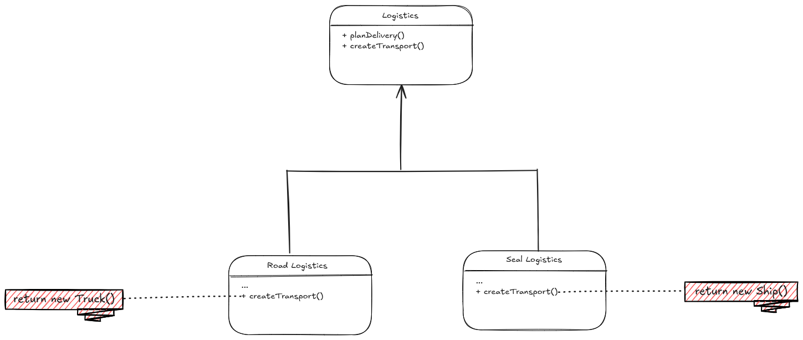
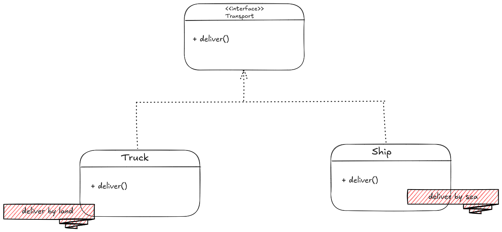

- The factory method pattern suggests that you replace direct object construction calls (using the *new* operator), with calls to a
special factory method.
- The objects will still be called with the *new* operator, but from within the factory method.
- Objects returned by a factory method are often reffered to as products.

- In the subclass, we can override the factory method and to return whatever other class we want.
- The limitation to this is that, although the subclasses return different types of product, the product must have a common interface / base class.
- The factory method in the base class must also declare it's return type as the interface / base class of the product.

- For example, both *Truck* and *Ship* classes should implement the *Transport* interface, which declares a method called *deliver()*.
- A truck and ship can handle the *deliver()* method's logic separately e.g. deliver by land or sea.
- The factory method in *RoadLogistics* class will return a *Truck* while the one in *SeaLogisitics* will return a *Ship*.
- The client code calling the factory method often doesn't see a difference between the actual products returned by the concrete factory methods in each
sub class, the client just treats all of them as abstract *Transport*.
- The client know that each object has a *deliver()8/ method, but doesn't have to know the exact implementation.