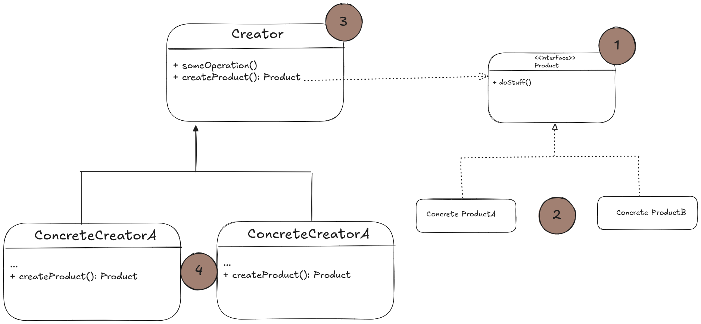
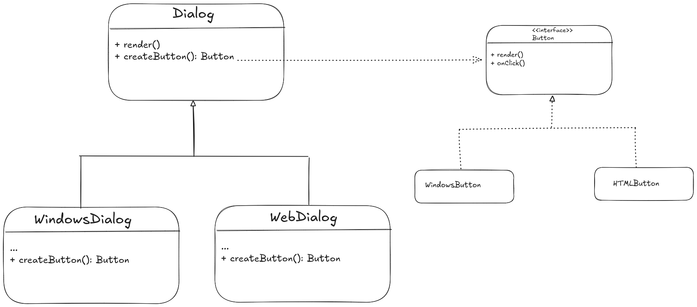

# Structure

- Excluding the client, the design of the factory pattern is made up of four parts:



1. **Product** declares the common interface for all object we want our factory to produce.
2. **Concrete Products** the different implementations of the product interface.
3. **Create class** declares the factory method that returns the products objects. It's return type matches the common interface
of the products.
The factory method can be declared as *abstract* to force all subclasses to implement this method, or as an alternative, the base
factory method can return a default product type.

> Unlike the name *creator*, product creation is not the core responsibility of the creator. You are allowed to add any other logic in here
as well, usually related to the products. The factory method simply helps to decouple the creation logic from the concrete product themselves.

# Pseudocode
- The example below demonstrates how the Factory Method can be used for creating cross-platform UI elements without coupling the client code to concrete UI classes.
- Suppose we are creating a Dialog box element that should work on both Windows and Web. THe buttons in the dialog box may
look different, but under the hood, they should work the same way.
- With the factory method, we don't create a *Dialog* class for each platform. 
- We instead create a factory method that produces buttons inside the Dialog class.
- We can later create a subclass that returns Windows-style buttons and Web-style buttons from the base class.
- The subclasses inherit most of the code from the base class, but because of the factory method, we can render Windows-esc
buttons on the screen.
- Just remember that for this pattern to work, the product, the buttons, must be abstracted over, such that the *Dialog*
class remains functional regardless of whatever button type it works with.



```html
// our creator class declares the factory method that must return an object of the product class
// the subclasses of the creator usually provide the implementation of this method
class Dialog is
    // the factory method. the creator class could provide a default implementation for it
    abstract method createButton(): Button
    
    // remember that the creator's primary responsibility isn't creating products.
    // it could usually have some core business logic that relies on the products created by the factory method.
    // subclasses can override the logic by overidding the factory method and returning a different type of product from it.
    method render() is
        // call the factory method to create a product object
        Button okButton = createButton()
        
        // now use the product
        okButton.onClick(closeDialog)
        okButton.render()

// concrete creators override the factory method to change the resulting product's type
class WindowsDialog extends Dialog is
    method createButton(): Button is
        return new WindowsButton()
        
class WebDialog extends Dialog is
    method createButton(): Button is
        return new HTMLButton()
        
// the product interface declares the ops that all concrete products must implement
interface Button is
    method render()
    method onClick(f)
    
// concrete products provide various implementations of the product interface
class WindowsButton implements Button is
    method render(a, b) is
        // render a button windows style
        
    method onClick(f) is
        // bind to the native OS click event
        
class HTMLButton implements Button is
method render(a, b) is
    // render a button HTML style
    
method onClick(f) is
    // bind to the web browser click event
    
// application's main class
class Application is
    field dialog: Dialog
    
    // the application picks a creator's type depending on the current config or env var
    method initialize() is
        config = readApplicationConfigFile()
        
        if (config.OS == "Windows") then
            dialog = new WindowsDialog()
        else if (config.OS == "Web") then
            dialog = new WebDialog()
        else
            throw new Exception("Error! Unknown OS.")
            
    method main() is
        this.initialize()
        dialog.render()
```