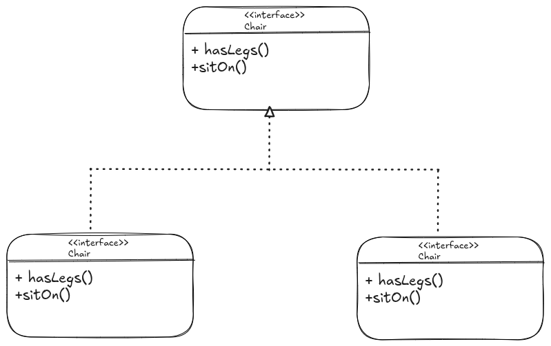
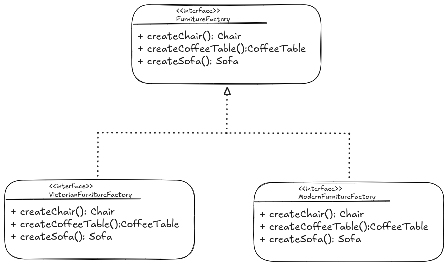

- Firstly, the Abstract Factory method suggests that you explicitly declare interfaces for each distinct product of the product
family e.g chair, sofa, coffee table.
- Then, make all variants of products follow those interfaces e.g. all chair variants can implement the *Chair* inteface and
all coffee table variants can implement the *CoffeeTable* interface e.t.c

- Next, we declare an *Abstract Factory* which is an interface with a list of creation methods for all products that are part
of the product family (e.g. *createChair()*, *createSofa()*, *createCoffeeTable()*).
- The factory (creation) methods must return **abstract product types** represented by the interfaces we extracted previously
e.g. *Chair*, *Sofa*, *CoffeeTable*

- Notice above how for each variant of a product family, we create a separate factory class based on the *AbstractFactory*
interface. 
- The factory is a class that returns products of a particular kind e.g. the *ModernFurnitureFactory* can only create
*ModernChair*, *ModernSofa* and *ModernCoffeeTable* objects.
- The client code works with both factories and products via their respective abstract interfaces meaning that we can change
the factory type we pass to the client code, as well as the product variant the client code receives, without breaking
the actual client code.
- But because of the abstractions, if the client wants a chair, it doesn't need to know what kind of chair it will get, or what
kind of factory produced the chair. All it has to know is that each chair will have a *sitOn()* method.
- Similarly, the client can be sure that whatever variant of the chair is returned, the factory method will always return sofas
and coffee table of a similar variant.