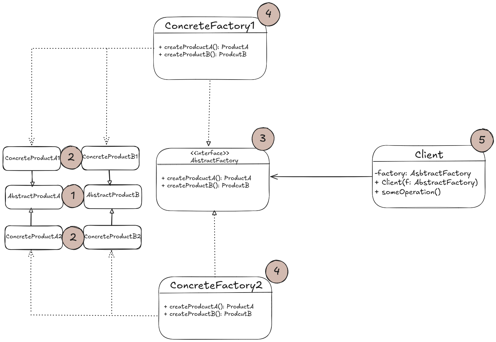
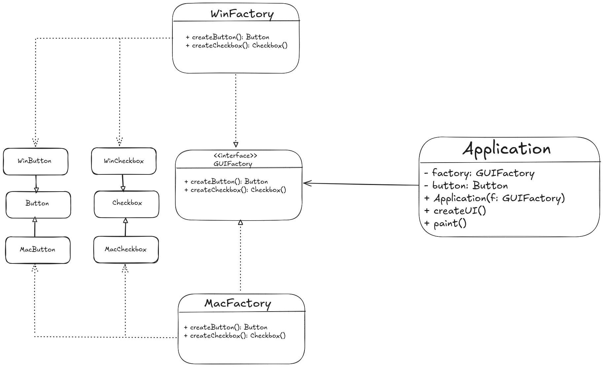

# Structure
- Including the client, the design of the abstract factory pattern is made up of 5 parts:



1. **Abstract Products** declare interfaces for a set of distinct but related products which make up a product family.
2. **Concrete Products** various implementation of abstract products grouped by variants. Each abstract product (chair, sofa)
must be implemented in all given variants (Victorian / Modern e.t.c)
3. The **Abstract Factory** interface declares a set of methods for creating each of the abstract products.
4. **Concrete factories** implement creation methods of the abstract factory, with each corresponding to a specific variant of
products and creates only those product variants.

- Note that the signature of the creation methods returns abstract products even though the method logic usually creates a
concrete product. This allows for loose coupling between the client and the specific variant of the product it gets from a 
factory.
- The client can work with any concrete factory/product variant, as long as it communicates with their objects via abstract
interfaces.

# Pseudocode
- The example below demonstrates how the Abstract Factory pattern can be used for creating cross-platform UI elements without
coupling the client code to concrete UI classes, while keeping all created elements consistent with a selected OS:



- The same UI elements in a cross-platform app are expected to behae similarly but look a bit different across different OSs.
- It's our job to make sure that the UI elements match the style of the current OS.
- Our Abstract Factory interface declares a set of creation methods that the client code can use to produce different types of
UI elements, and their concrete implementations produce UI elements that match that particular OS.
- When the app launches, it checks the platform it is on and creates the relevant concrete factory, which the rest of the code
will use to create the UI elements.
- With this approach, the client code doesn't need to depend on concrete classes of factories and UI elements, as long as it
works with these objects via their abstract interfaces.
- Therefore, next time you want to add a new variation of UI elements (e.g. for a different os), you just have to create a new
factory class that produces these elements and slightly modify the apps's initialization code so that it initializes with the
relevant factory when appropriate.

```html
// The abstract factory interface declares a set of methods that
// return different abstract products. These products are called
// a family and are related by a high-level theme or concept.
// Products of one family are usually able to collaborate among
// themselves. A family of products may have several variants,
// but the products of one variant are incompatible with the
// products of another variant.
interface GUIFactory is
    method createButton():Button
    method createCheckbox():Checkbox
    
// Concrete factories produce a family of products that belong
// to a single variant. The factory guarantees that the
// resulting products are compatible. Signatures of the concrete
// factory's methods return an abstract product, while inside
// the method a concrete product is instantiated.
class WinFactory implements GUIFactory is
    method createButton():Button is
        return new WinButton()
    method createCheckbox():Checkbox is
        return new WinCheckbox()
        
// Each concrete factory has a corresponding product variant.
class MacFactory implements GUIFactory is
    method createButton():Button is
        return new MacButton()
    method createCheckbox():Checkbox is
        return new MacCheckbox()
        
// Each distinct product of a product family should have a base
// interface. All variants of the product must implement this
// interface.
interface Button is
    method paint()
    
// Concrete products are created by corresponding concrete
// factories.
class WinButton implements Button is
    method paint() is
        // Render a button in Windows style.

class MacButton implements Button is
    method paint() is
        // Render a button in macOS style.
        
// Here's the base interface of another product. All products
// can interact with each other, but proper interaction is
// possible only between products of the same concrete variant.
interface Checkbox is
    method paint()

class WinCheckbox implements Checkbox is
    method paint() is
        // Render a checkbox in Windows style.

class MacCheckbox implements Checkbox is
    method paint() is
        // Render a checkbox in macOS style.
        
// The client code works with factories and products only
// through abstract types: GUIFactory, Button and Checkbox. This
// lets you pass any factory or product subclass to the client
// code without breaking it.
class Application is
    private field factory: GUIFactory
    private field button: Button
    constructor Application(factory: GUIFactory) is
        this.factory = factory
    method createUI() is
        this.button = factory.createButton()
    method paint() is
        button.paint()
        
// The application picks the factory type depending on the
// current configuration or environment settings and creates it
// at runtime (usually at the initialization stage).
class ApplicationConfigurator is
    method main() is
        config = readApplicationConfigFile()

        if (config.OS == "Windows") then
            factory = new WinFactory()
        else if (config.OS == "Mac") then
            factory = new MacFactory()
        else
            throw new Exception("Error! Unknown operating system.")

        Application app = new Application(factory)
```
