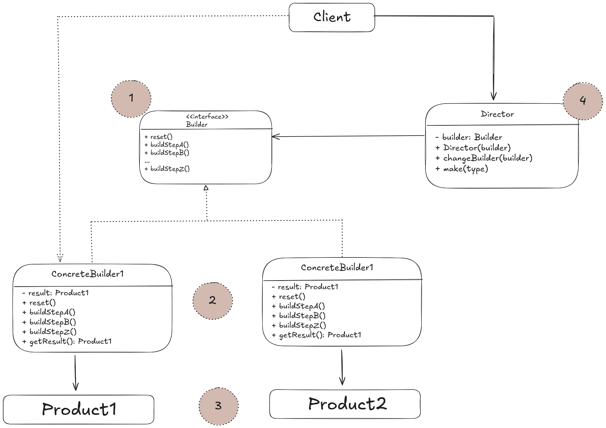
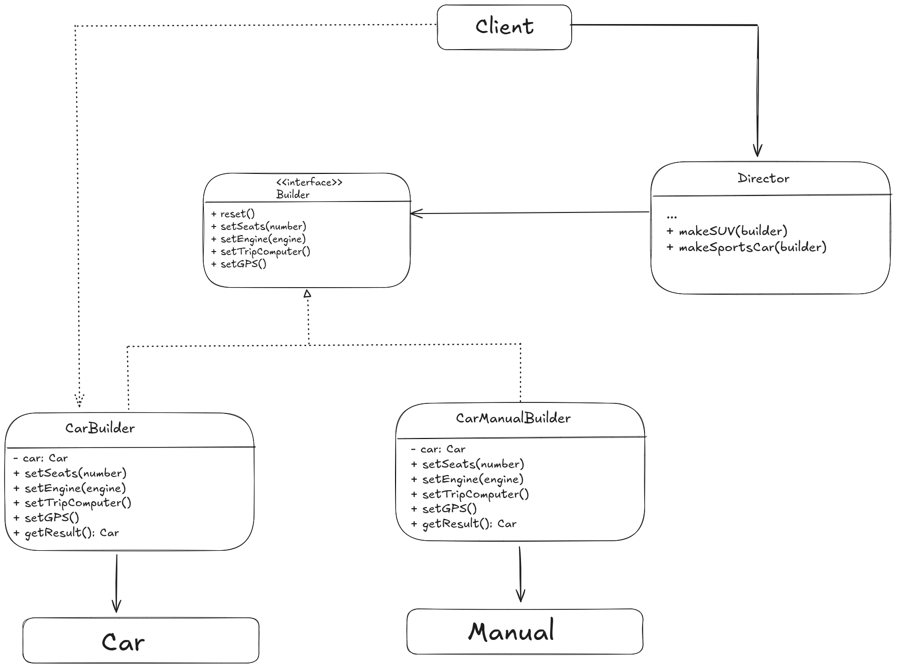

# Structure
- Including the client, the design of the builder pattern is made up of 5 parts:



1. The **Builder** interface declares product constructions teps that are common to all types of builders.
2. **Concrete Builders** provide different implementations of the construction steps. Concrete builders may produce products
that don't follow the common interface.
3. **Products** are the resulting objects. Products constructed by different builders don't have to belong to the same class,
hierarchy or interface.
4. The **Director** class defines the order in which to call construction steps, so you can create and reuse specific
configurations of products.
5. The **client** must associate one of the builder objects with the director. This is usually done just once, via the params
of the director's constructor, then the director uses that builder object for all further construction.

# Pseudocode
This example of the builder pattern illustrates how you can reuse the same object construction code when building different
types of products, such as cars, and creating the corresponding manuals for them.



- A car is a complex object that can be constructed in a hundred different ways, so we create a builder class with a set of
methods for configuring various parts of the car.
- If the client needs to assemble a special, fine-tuned model of a car, it can work with the builder directly.
- On the other hand, it can delegate the assembly to the director class, which knows how to use a builder to constuct several
of the most popular models of cars.
- For the vehicle's manual, it should describe every feature of the car, so the details in the manuals vary across different
models. This is why it makes sense to resuse an existing construction process for both real cars and their respective manuals.
- This specific builder class implements the same building methods as its car-building sibling, but instead of creafting car
parts, it describes them.
- By passing these builders to the same director, we can construct either a car or a manual.
- Finally we fetch the resulting object (*getResult()*). A metal car and a paper manual, although related are still very
different things. We therefore can't place a method for fetching results in the director without coupling the direcotr to 
concrete product classes. Hence, we obtain the result of the construction from the builder which performed the job.

```html
// Using the Builder pattern makes sense only when your products
// are quite complex and require extensive configuration. The
// following two products are related, although they don't have
// a common interface.
class Car is
    // A car can have a GPS, trip computer and some number of
    // seats. Different models of cars (sports car, SUV,
    // cabriolet) might have different features installed or
    // enabled.

class Manual is
    // Each car should have a user manual that corresponds to
    // the car's configuration and describes all its features.
    
// The builder interface specifies methods for creating the
// different parts of the product objects.
interface Builder is
    method reset()
    method setSeats(...)
    method setEngine(...)
    method setTripComputer(...)
    method setGPS(...)
    
// The concrete builder classes follow the builder interface and
// provide specific implementations of the building steps. Your
// program may have several variations of builders, each
// implemented differently.
class CarBuilder implements Builder is
    private field car:Car

    // A fresh builder instance should contain a blank product
    // object which it uses in further assembly.
    constructor CarBuilder() is
        this.reset()

    // The reset method clears the object being built.
    method reset() is
        this.car = new Car()

    // All production steps work with the same product instance.
    method setSeats(...) is
        // Set the number of seats in the car.

    method setEngine(...) is
        // Install a given engine.

    method setTripComputer(...) is
        // Install a trip computer.

    method setGPS(...) is
        // Install a global positioning system.

    // Concrete builders are supposed to provide their own
    // methods for retrieving results. That's because various
    // types of builders may create entirely different products
    // that don't all follow the same interface. Therefore such
    // methods can't be declared in the builder interface (at
    // least not in a statically-typed programming language).
    //
    // Usually, after returning the end result to the client, a
    // builder instance is expected to be ready to start
    // producing another product. That's why it's a usual
    // practice to call the reset method at the end of the
    // `getProduct` method body. However, this behavior isn't
    // mandatory, and you can make your builder wait for an
    // explicit reset call from the client code before disposing
    // of the previous result.
    method getProduct():Car is
        product = this.car
        this.reset()
        
// Unlike other creational patterns, builder lets you construct
// products that don't follow the common interface.
class CarManualBuilder implements Builder is
    private field manual:Manual

    constructor CarManualBuilder() is
        this.reset()

    method reset() is
        this.manual = new Manual()

    method setSeats(...) is
        // Document car seat features.

    method setEngine(...) is
        // Add engine instructions.

    method setTripComputer(...) is
        // Add trip computer instructions.

    method setGPS(...) is
        // Add GPS instructions.

    method getProduct():Manual is
        // Return the manual and reset the builder.
        
// The director is only responsible for executing the building
// steps in a particular sequence. It's helpful when producing
// products according to a specific order or configuration.
// Strictly speaking, the director class is optional, since the
// client can control builders directly.
class Director is
    // The director works with any builder instance that the
    // client code passes to it. This way, the client code may
    // alter the final type of the newly assembled product.
    // The director can construct several product variations
    // using the same building steps.
    method constructSportsCar(builder: Builder) is
        builder.reset()
        builder.setSeats(2)
        builder.setEngine(new SportEngine())
        builder.setTripComputer(true)
        builder.setGPS(true)

    method constructSUV(builder: Builder) is
        // ...

// The client code creates a builder object, passes it to the
// director and then initiates the construction process. The end
// result is retrieved from the builder object.
class Application is

    method makeCar() is
        director = new Director()

        CarBuilder builder = new CarBuilder()
        director.constructSportsCar(builder)
        Car car = builder.getProduct()

        CarManualBuilder builder = new CarManualBuilder()
        director.constructSportsCar(builder)

        // The final product is often retrieved from a builder
        // object since the director isn't aware of and not
        // dependent on concrete builders and products.
        Manual manual = builder.getProduct()
```
