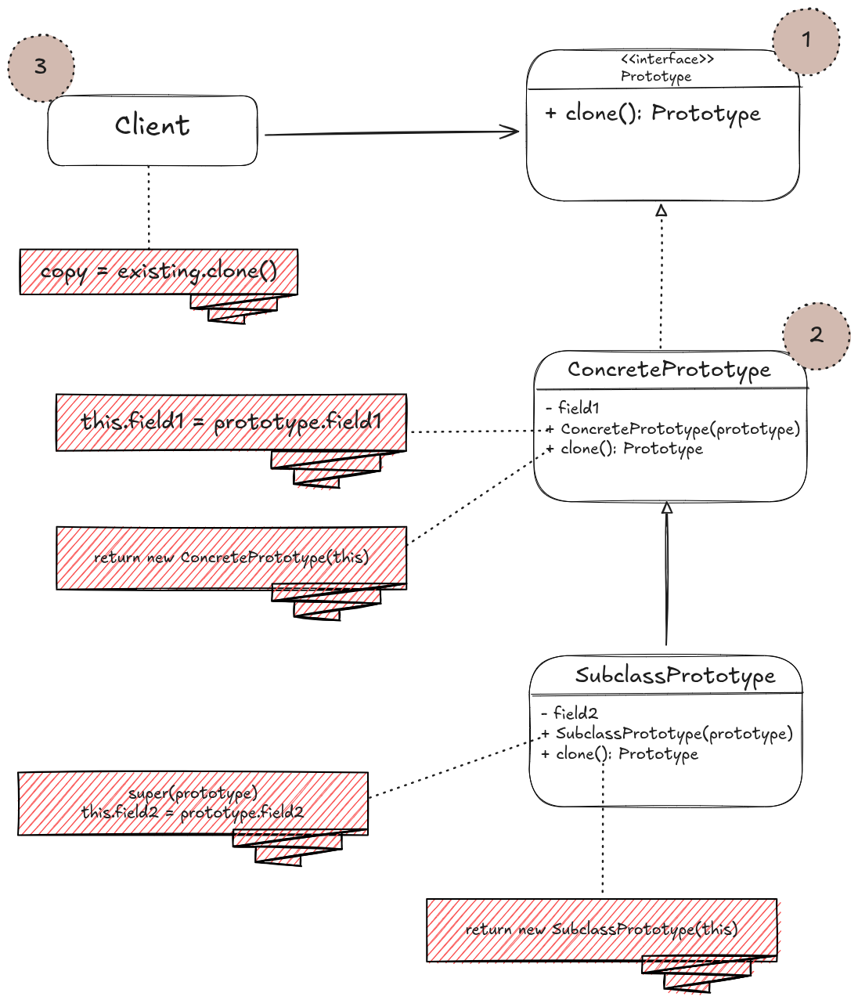
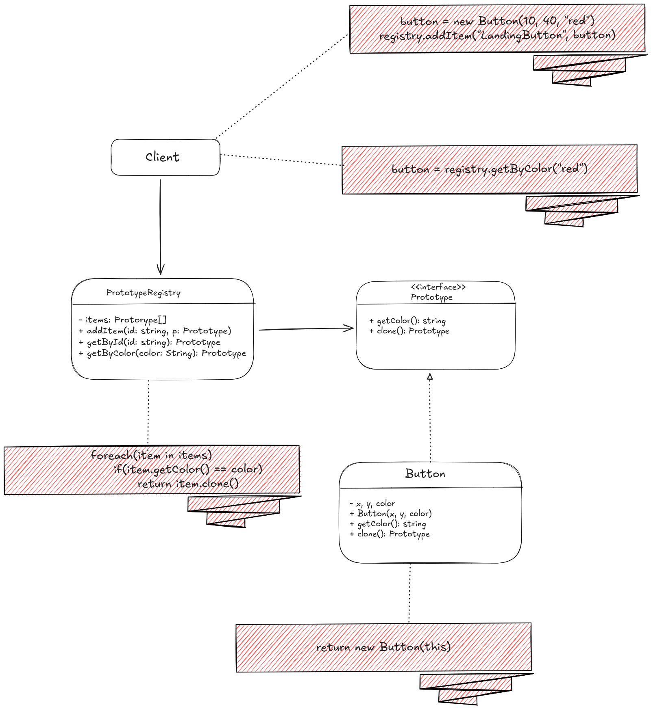

# Structure
- Including the client, the design of the prototype pattern is made up of 3 parts:



1. The **prototype** interface delcares the cloning methods, which in most cases is a single *clone()* method.
2. The **Concrete Prototype** implements the cloning method. In addition to cloning the object's data to the clone, this method
may also handle some edge cases of the cloning process related to cloning linked ibjects, untangling recursive dependencies,
e.t.c
3. The **Client** can produce a copy of any object that follows the prototype interface.



4. The **Prototype Registry** provides an easy way to access frequently-used prototypes. It stores a s set of pre-built objects that
are ready to be copied. The simplest prototype registry is `name -> prototype` hashmap. However, if you need better search criteria than
a simple name, you can build a much more robust version of the registry.

# Pseudocode
- In our example here, all shape classes follow the same interface, which provides a cloning method. A subclass may call the parent's cloning
method before copying its own field values to the resulting object.

```html
// Base prototype.
abstract class Shape is
    field X: int
    field Y: int
    field color: string

    // A regular constructor.
    constructor Shape() is

    // The prototype constructor. A fresh object is initialized
    // with values from the existing object.
    constructor Shape(source: Shape) is
        this()
        this.X = source.X
        this.Y = source.Y
        this.color = source.color
    
    // The clone operation returns one of the Shape subclasses.
    abstract method clone():Shape

// Concrete prototype. The cloning method creates a new object
// in one go by calling the constructor of the current class and
// passing the current object as the constructor's argument.
// Performing all the actual copying in the constructor helps to
// keep the result consistent: the constructor will not return a
// result until the new object is fully built; thus, no object
// can have a reference to a partially-built clone.
class Rectangle extends Shape is
    field width: int
    field height: int

    constructor Rectangle(source: Rectangle) is
        // A parent constructor call is needed to copy private
        // fields defined in the parent class.
        super(source)
        this.width = source.width
        this.height = source.height
    
    method clone():Shape is
        return new Rectangle(this)
    
class Circle extends Shape is
    field radius: int

    constructor Circle(source: Circle) is
        super(source)
        this.radius = source.radius
    
    method clone():Shape is
        return new Circle(this)
    
// Somewhere in the client code.
class Application is
    field shapes: array of Shape

    constructor Application() is
        Circle circle = new Circle()
        circle.X = 10
        circle.Y = 10
        circle.radius = 20
        shapes.add(circle)

        Circle anotherCircle = circle.clone()
        shapes.add(anotherCircle)
        // The `anotherCircle` variable contains an exact copy
        // of the `circle` object.

        Rectangle rectangle = new Rectangle()
        rectangle.width = 10
        rectangle.height = 20
        shapes.add(rectangle)

    method businessLogic() is
        // Prototype rocks because it lets you produce a copy of
        // an object without knowing anything about its type.
        Array shapesCopy = new Array of Shapes.

        // For instance, we don't know the exact elements in the
        // shapes array. All we know is that they are all
        // shapes. But thanks to polymorphism, when we call the
        // `clone` method on a shape the program checks its real
        // class and runs the appropriate clone method defined
        // in that class. That's why we get proper clones
        // instead of a set of simple Shape objects.
        foreach (s in shapes) do
            shapesCopy.add(s.clone())

        // The `shapesCopy` array contains exact copies of the
        // `shape` array's children.

```