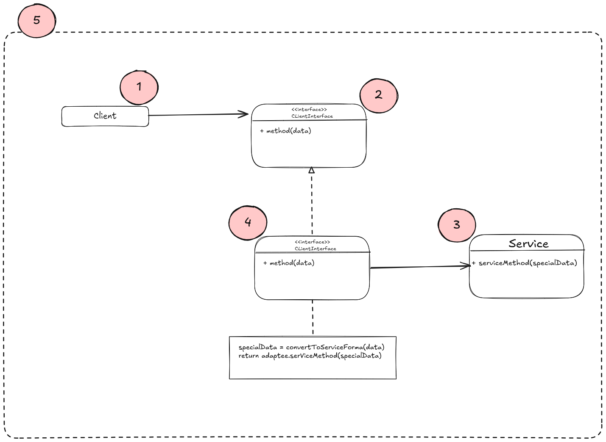
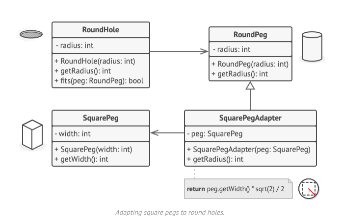

# Structure

## Implementation version 1
- This implementation uses the object composition principle: the adapter implements the interface of one object, and wraps
  the other one.



1. **Client** is a class that contains the existing business logic of the program.
2. **Client Interface** describes a protocol that other classes must follow to collaborate with the client code.
3. **Service** is usually some 3rd party library or a legacy codebase that the client can't use directly because it
  has an icompatible interface.
4. The **Adapter** is a class that is able to work with both the client and the service. It implements the client 
  interface, while wrapping the service object.
  It receives calls from the client via the client interface and translates them into calls to the wrapped service
  object in a format it can understand.
5. The **Client** code doesn't get coupled to the concrete adapter class as long as it works with the adapter via the
  client interface. Thanks to this, we can introduce new types of adapters into the program without breaking the existing
  code.
  This can be useful when the interface of the service class gets changes or replaced: you can just create a new adapter
  class without changing the client code.

# Pseudocode
- This example attempts to sort the square peg in round hole issue.



```html
// Say you have two classes with compatible interfaces:
// RoundHole and RoundPeg.
class RoundHole is
    constructor RoundHole(radius) { ... }

    method getRadius() is
        // Return the radius of the hole.

    method fits(peg: RoundPeg) is
        return this.getRadius() >= peg.getRadius()
        
class RoundPeg is
    constructor RoundPeg(radius) { ... }

    method getRadius() is
        // Return the radius of the peg.

// But there's an incompatible class: SquarePeg.
class SquarePeg is
    constructor SquarePeg(width) { ... }

    method getWidth() is
        // Return the square peg width.
        
// An adapter class lets you fit square pegs into round holes.
// It extends the RoundPeg class to let the adapter objects act
// as round pegs.
class SquarePegAdapter extends RoundPeg is
    // In reality, the adapter contains an instance of the
    // SquarePeg class.
    private field peg: SquarePeg

    constructor SquarePegAdapter(peg: SquarePeg) is
        this.peg = peg

    method getRadius() is
        // The adapter pretends that it's a round peg with a
        // radius that could fit the square peg that the adapter
        // actually wraps.
        return peg.getWidth() * Math.sqrt(2) / 2
        
// Somewhere in client code.
hole = new RoundHole(5)
rpeg = new RoundPeg(5)
hole.fits(rpeg) // true

small_sqpeg = new SquarePeg(5)
large_sqpeg = new SquarePeg(10)
hole.fits(small_sqpeg) // this won't compile (incompatible types)

small_sqpeg_adapter = new SquarePegAdapter(small_sqpeg)
large_sqpeg_adapter = new SquarePegAdapter(large_sqpeg)
hole.fits(small_sqpeg_adapter) // true
hole.fits(large_sqpeg_adapter) // false
```
