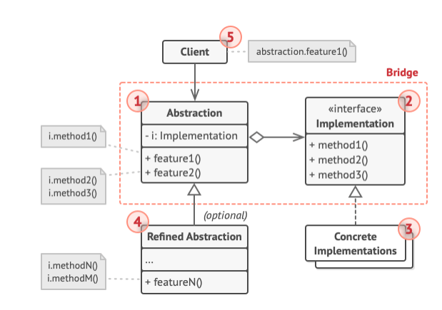
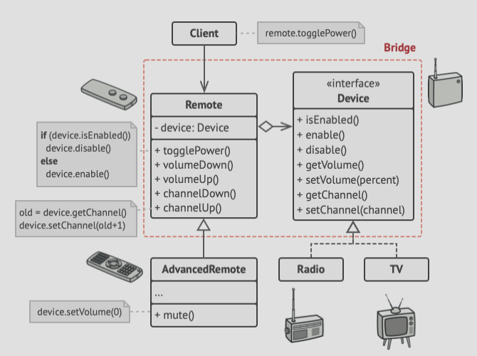

# Structure


1. The **Abstraction** provides high-levlel control logic and relies on the implementation object to do the actual
   low level work.
2. The **Implementation** declares the interface that is common for all concrete implementations. An abstraction can
   only communicate with an implementation object via methods declared here.
3. **Concrete implementation** contains platform-specific code.
4. **Refined abstractions** provide variants of control logic. Like their parent, they work with different implementations
   via the general implementation interface.
5. **The client** (you) only cares about working with the abstraction. It is however the clien'ts job to link the
   abstraction object with one of the implementation objects.

# Pseudocode
- This example illustrates how the Bridge pattern can help divide the monolithic code of an app that manages devices
  and their remote controls.
- The *Device* classes act as the implementation, whereas the *Remote*s class acts as the abstraction:



- The base remote control class declares a reference field that links it with a device object.
- All remotes work with the devices via the general device interface, which lets the same remote support multiple
  device types.
- You can develop the remote control classes separately from the device classes, as all that is needed is to create
  a new remote subclass.
- The client code links the desired type of remote control with a specicif device object via the remote's constructor.

```html
// The "abstraction" defines the interface for the "control"
// part of the two class hierarchies. It maintains a reference
// to an object of the "implementation" hierarchy and delegates
// all of the real work to this object.
class RemoteControl is
    protected field device: Device
    constructor RemoteControl(device: Device) is
        this.device = device
    method togglePower() is
        if (device.isEnabled()) then
            device.disable()
        else
            device.enable()
    method volumeDown() is
        device.setVolume(device.getVolume() - 10)
    method volumeUp() is
        device.setVolume(device.getVolume() + 10)
    method channelDown() is
        device.setChannel(device.getChannel() - 1)
    method channelUp() is
        device.setChannel(device.getChannel() + 1)
        
// You can extend classes from the abstraction hierarchy
// independently from device classes.
class AdvancedRemoteControl extends RemoteControl is
    method mute() is
        device.setVolume(0)

// The "implementation" interface declares methods common to all
// concrete implementation classes. It doesn't have to match the
// abstraction's interface. In fact, the two interfaces can be
// entirely different. Typically the implementation interface
// provides only primitive operations, while the abstraction
// defines higher-level operations based on those primitives.
interface Device is
    method isEnabled()
    method enable()
    method disable()
    method getVolume()
    method setVolume(percent)
    method getChannel()
    method setChannel(channel)
    
// All devices follow the same interface.
class Tv implements Device is
    // ...

class Radio implements Device is
    // ...

// Somewhere in client code.
tv = new Tv()
remote = new RemoteControl(tv)
remote.togglePower()

radio = new Radio()
remote = new AdvancedRemoteControl(radio)
```