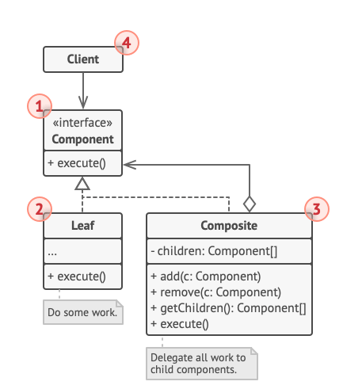
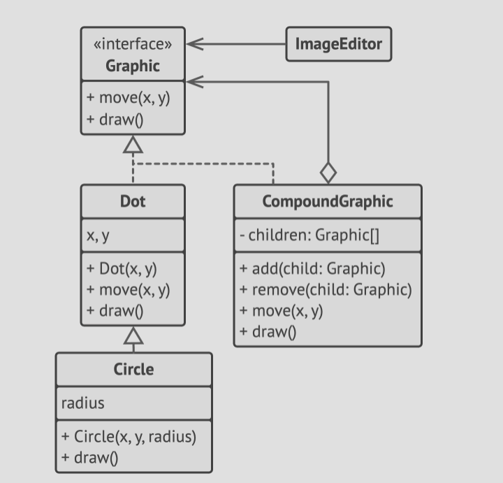

# Structure


1. The **component** interface describes operations that are common to both simple and complex elements of the
   tree.
2. The **Leaf** (simple product) is a basic element of a tree that doesn't have sub-elements. The leaf components
   usually do their own work as they don't have anyone to delegate to.
3. The **Container** (composite) is an element that contains sub-elements (i.e. is a box). A container doesn't know the
   concrete classes of its children. It works with all sub-elements only via the component interface.
4. The **Client** works with all elements through the component interface. Resultantly, the client will work the same way
   with both simple and complex elements of the tree.

# Pseudocode
- In this example, we use the *Composite* pattern to implement stacking of geometric shapes in a graphical editor.

- 
- `Compound Graphic` is a container that can compromise of any number of sub-shapes, including other compound shapes.
- A compound shape has the same methods as a simple shape. However, instead of doing something on its own, a compoiund shape
  passes the request recursively to all its children and 'sums up' the result.
- The client code works with all shapes through the single interface common to all shape classes, thus doesn't know whether it
  is working with a simple shape or a compound one.
- The client can work with very complex object structures without being coupled to concrete classes that form that structure.

```html
// The component interface declares common operations for both
// simple and complex objects of a composition.
interface Graphic is
    method move(x, y)
    method draw()
    
// The leaf class represents end objects of a composition. A
// leaf object can't have any sub-objects. Usually, it's leaf
// objects that do the actual work, while composite objects only
// delegate to their sub-components.
class Dot implements Graphic is
    field x, y

    constructor Dot(x, y) { ... }

    method move(x, y) is
        this.x += x, this.y += y

    method draw() is
        // Draw a dot at X and Y.
        
// All component classes can extend other components.
class Circle extends Dot is
    field radius

    constructor Circle(x, y, radius) { ... }

    method draw() is
        // Draw a circle at X and Y with radius R.
        
// The composite class represents complex components that may
// have children. Composite objects usually delegate the actual
// work to their children and then "sum up" the result.
class CompoundGraphic implements Graphic is
    field children: array of Graphic

    // A composite object can add or remove other components
    // (both simple or complex) to or from its child list.
    method add(child: Graphic) is
        // Add a child to the array of children.

    method remove(child: Graphic) is
        // Remove a child from the array of children.

    method move(x, y) is
        foreach (child in children) do
            child.move(x, y)

    // A composite executes its primary logic in a particular
    // way. It traverses recursively through all its children,
    // collecting and summing up their results. Since the
    // composite's children pass these calls to their own
    // children and so forth, the whole object tree is traversed
    // as a result.
    method draw() is
        // 1. For each child component:
        //     - Draw the component.
        //     - Update the bounding rectangle.
        // 2. Draw a dashed rectangle using the bounding
        // coordinates.

// The client code works with all the components via their base
// interface. This way the client code can support simple leaf
// components as well as complex composites.
class ImageEditor is
    field all: CompoundGraphic

    method load() is
        all = new CompoundGraphic()
        all.add(new Dot(1, 2))
        all.add(new Circle(5, 3, 10))
        // ...

    // Combine selected components into one complex composite
    // component.
    method groupSelected(components: array of Graphic) is
        group = new CompoundGraphic()
        foreach (component in components) do
            group.add(component)
            all.remove(component)
        all.add(group)
        // All components will be drawn.
        all.draw()
```