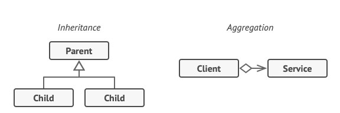
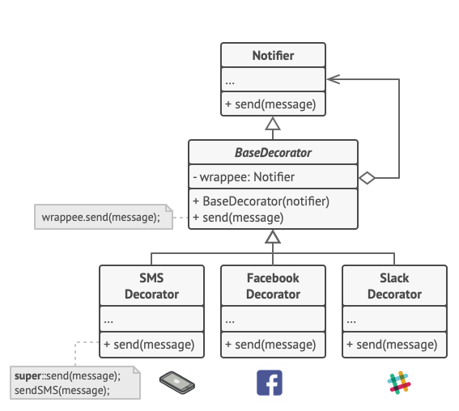
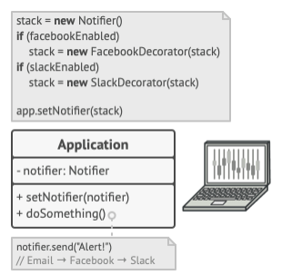

- Extending a class is usually the first thing that comes to mind when you need to alter an object's behaviour.
- However, inheritance has some quirks you need to be aware of:
  1. Inheritance is static - you can't alyer the behaviour of an existing object at runtime, you can only replace the whole
     object with another one that's created from a different subclass.
  2. Subclasses can have just one parent class in most languages.

- A common way to overcome these caveats us by using `Aggregation` / `Composition` instead of `Inheritance`.
- In almost both cases, an object **has** a reference to another and delegates it some work, whereas with inheritance, the
  object itself is able to do that work, inheriting the behaviour from its superclass.
- With this new approach, you can easily substitute the linked 'helper' object with another, changing the behaviour of the
  container object at runtime.
- Aggregation/composition is the key principle behind many design patterns, including Decorator.

# Solution
- 'Wrapper' is the alternative nickame for the Decorator pattern, clearly expressing the intent of the pattern.
- A *wrapper* is an object that can be linked with some *target* object.
- The wrapper contains the same set of methods as the target, and delegates to it all requests it receives.
- The wrapper at times however may alter the result by doing something either before or after it passes the request to the
  target.
- From the client's perspective, these objects are identical.
- We make the wrapper's reference field accept any object that follows that interface, letting you cover an object in multiple
  wrappers, adding the combined behaviour of all the wrappers to it.
- In our example, we will leave the simple email notification behaviour inside the base `Notifier` class, but turn all other
  notification methods into decorators.

- The client code would need to wrap a basic notifier object into a set of decorators that match the client's preferences, in
  something similar to a stack:

- The last decorator in the stack is the object that the client actually works with. Since all decorators implement the same
  interface as the base notifier, the rest of the client code won't care whether it works with the 'pure' notifier object
  or the decorated one.
- We could apply the same approach to other behaviours such as formatting messages, or composing the recipient list.
- The client can decorate the object with any custom decorators, as long as they follow the same interface as others.