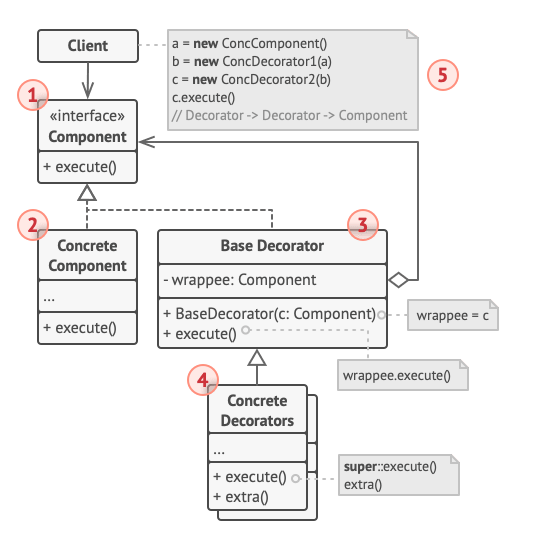
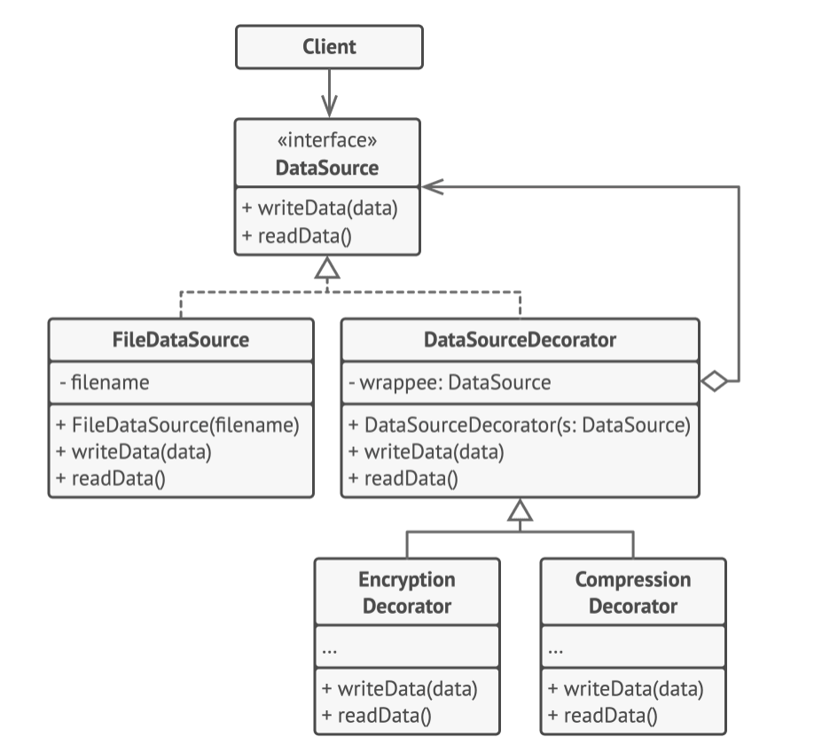

# Structure


1. The **component** declares the common interface for both wrappers and wrapped objects.
2. The **concrete component** is a class of objects being wrapped. It defines basic behaviours that can be altered by
   decorators.
3. The **base decorator** class has a field for referencing a wrapped object. The field's type should be declared as the
   component interface, so that it can contain both concrete components and decorators. The base decorator delegates
   all operations to the wrapped object.
4. The **concrete decorators** define extra behaviours that can be added to components dynamically. Concrete decorators
   override methods of the base decorator and execute their behaviour either before or after calling the parent method.
5. The **client** can wrap components in multiple layers of decorators, as long as it works with all objects via the
   component interface.

# Pseucode
In this example, the *Decorator* pattern lets you compress and encrypt sensitive data independently from the code that actually
uses this data.



The application wraps the data source object with a pair of decorators. Both wrappers change the way the data is written to and read
from the disk.
- Just before data is **written to disk**, the decorators encrypt and compress it. The original class writes the encrypted data to the
  file without knowing about the change.
- Right after data is **read from disk**, it goes through the same decorators, which decompress and decode it.

Note that the decorators and data source class implement the same interface, which makes them interchangeable in the client code.

```html
// The component interface defines operations that can be
// altered by decorators.
interface DataSource is
    method writeData(data)
    method readData():data
    
// Concrete components provide default implementations for the
// operations. There might be several variations of these
// classes in a program.
class FileDataSource implements DataSource is
    constructor FileDataSource(filename) { ... }

    method writeData(data) is
        // Write data to file.

    method readData():data is
        // Read data from file.
        
// The base decorator class follows the same interface as the
// other components. The primary purpose of this class is to
// define the wrapping interface for all concrete decorators.
// The default implementation of the wrapping code might include
// a field for storing a wrapped component and the means to
// initialize it.
class DataSourceDecorator implements DataSource is
    protected field wrappee: DataSource

    constructor DataSourceDecorator(source: DataSource) is
        wrappee = source

    // The base decorator simply delegates all work to the
    // wrapped component. Extra behaviors can be added in
    // concrete decorators.
    method writeData(data) is
        wrappee.writeData(data)

    // Concrete decorators may call the parent implementation of
    // the operation instead of calling the wrapped object
    // directly. This approach simplifies extension of decorator
    // classes.
    method readData():data is
        return wrappee.readData()
        
// Concrete decorators must call methods on the wrapped object,
// but may add something of their own to the result. Decorators
// can execute the added behavior either before or after the
// call to a wrapped object.
class EncryptionDecorator extends DataSourceDecorator is
    method writeData(data) is
        // 1. Encrypt passed data.
        // 2. Pass encrypted data to the wrappee's writeData
        // method.

    method readData():data is
        // 1. Get data from the wrappee's readData method.
        // 2. Try to decrypt it if it's encrypted.
        // 3. Return the result.
        
// You can wrap objects in several layers of decorators.
class CompressionDecorator extends DataSourceDecorator is
    method writeData(data) is
        // 1. Compress passed data.
        // 2. Pass compressed data to the wrappee's writeData
        // method.

    method readData():data is
        // 1. Get data from the wrappee's readData method.
        // 2. Try to decompress it if it's compressed.
        // 3. Return the result.
        
// Option 1. A simple example of a decorator assembly.
class Application is
    method dumbUsageExample() is
        source = new FileDataSource("somefile.dat")
        source.writeData(salaryRecords)
        // The target file has been written with plain data.

        source = new CompressionDecorator(source)
        source.writeData(salaryRecords)
        // The target file has been written with compressed
        // data.

        source = new EncryptionDecorator(source)
        // The source variable now contains this:
        // Encryption > Compression > FileDataSource
        source.writeData(salaryRecords)
        // The file has been written with compressed and
        // encrypted data.
        
// Option 2. Client code that uses an external data source.
// SalaryManager objects neither know nor care about data
// storage specifics. They work with a pre-configured data
// source received from the app configurator.
class SalaryManager is
    field source: DataSource

    constructor SalaryManager(source: DataSource) { ... }

    method load() is
        return source.readData()

    method save() is
        source.writeData(salaryRecords)
    // ...Other useful methods...


// The app can assemble different stacks of decorators at
// runtime, depending on the configuration or environment.
class ApplicationConfigurator is
    method configurationExample() is
        source = new FileDataSource("salary.dat")
        if (enabledEncryption)
            source = new EncryptionDecorator(source)
        if (enabledCompression)
            source = new CompressionDecorator(source)

        logger = new SalaryManager(source)
        salary = logger.load()
    // ...
```
