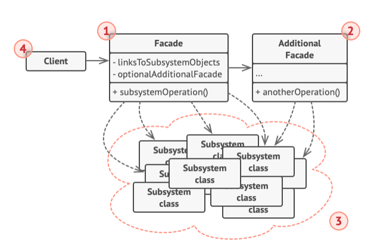

# Structure



1. The **Facade** provides convenient access to a particular part of the subsystem's functionality. It knows where
   to direct the client's request and how to operate all the moving parts.
2. An **Additional Facade** can be created to prevent pluting a single facade with unrelated features that might make
   it yet another complex structure. Additional facades can be used by both clients and other facades.
3. The **Complex Subsystem** is a set of complex features being abstracted over by the facade.
4. The **Client** uses the facade instead of calling the subsystem objects directly.

# Pseudocode
In this example, the **Facade** pattern simplifies interaction with a complex video compression framework.

```html
// These are some of the classes of a complex 3rd-party video
// conversion framework. We don't control that code, therefore
// can't simplify it.

class VideoFile
// ...

class OggCompressionCodec
// ...

class MPEG4CompressionCodec
// ...

class CodecFactory
// ...

class BitrateReader
// ...

class AudioMixer
// ...

// We create a facade class to hide the framework's complexity
// behind a simple interface. It's a trade-off between
// functionality and simplicity.
class VideoConverter is
    method convert(filename, format):File is
        file = new VideoFile(filename)
        sourceCodec = (new CodecFactory).extract(file)
        if (format == "mp4")
            destinationCodec = new MPEG4CompressionCodec()
        else
            destinationCodec = new OggCompressionCodec()
        buffer = BitrateReader.read(filename, sourceCodec)
        result = BitrateReader.convert(buffer, destinationCodec)
        result = (new AudioMixer()).fix(result)
        return new File(result)
        
// Application classes don't depend on a billion classes
// provided by the complex framework. Also, if you decide to
// switch frameworks, you only need to rewrite the facade class.
class Application is
    method main() is
        convertor = new VideoConverter()
        mp4 = convertor.convert("funny-cats-video.ogg", "mp4")
        mp4.save()
```