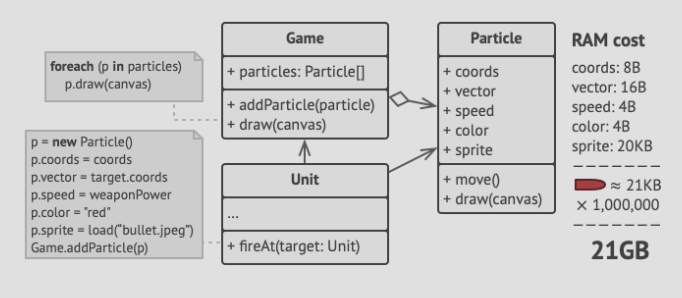

- Also known as the *cache* pattern, Flyweight lets uou fit mor eobjects into the available amount of RAM by sharing
  common parts of state between multiple objects instead of keeping all the data in one object.

# Problem
- Imagine you design a shooting game where players move around a map shooting at each other.
- The game runs flawlessly on your machine, but on your friends machine, it keeps crashing every few minutes.
- The game logs show that it's crushing because of insufficient RAM amounts on your friend's computer.
- You realize that the problem is related to your particle system:
  - Each particle e.g. a bullet, missle or sharpnel piece was represented by a separate object containing plenty of data.
  - At some point, when the carnage on the players screen is at climas, newly created particles no longer fit into the
    remaining RAM, so the program crashes.
  
