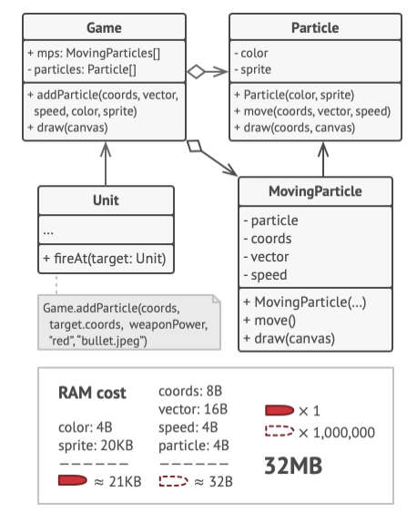
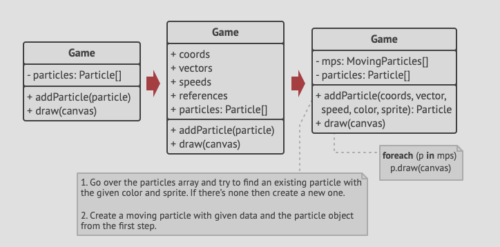

- A closer inspection of the `Particle` class reveals  that the `color` and `sprite` fields consume a lot more memory than
  other fields.
- Additionally, these two fields store almost identical data across all particle, e.g. all bullets have the same color
  and sprite.
- Other parts of a particle's state e.g co-ordinates, movement, vector and speed are unique to each particle, as these
  change as the game progresses.
- The constant data of an object is called *intrinsic state*. It lives within the object and other objects only have
  read permissions to it.
- The rest of object's state is called *extrinsic state*, and can be altered from the outside by other objects.
- Flyweight pattern suggests that you stop storing the extrinsic state inside the object.
- Instead, you should pass this state to specific methods which rely on it.
- Only the intrinsic state stays within the object, letting you re-use it in different contexts.
- As a result, you'd need fewer of these objects since they only differ in the intrinsic state, which has much fewer
  variations than the extrinsic.

- Back to our game problem, assuming we extracted the extrinsic state from out particle class, only three different objects
  would be enough to represent all particles in the game: a bullet, a missle and a shrapnel.
- An object that only stores the intrinsic state is called a *flyweight*.

# Extrinsic State Storage.
- In most cases, the extrinsic state gets moved to a container object, which aggregates objects before we apply the pattern.
In our case, that's the main `Game` object, that stores all particles in a `particles` field. 
- But first, you need to create several array fields for storing coordinates, vectors and speed of each individual particle.
- Moreover, you need another array for storing references to a specific flyweight that represents a particle.
- The arrays must be in sync so that you can access all data of a particle using the same index.
See the depiction below:

- This is complicated.
- A more elegant solution is to store the extrinsic state in a separate context class, which then references a flyweight
  object.
- In such a case, the container class, `Game` only stores a single array of context objects.
- Note that, even though we would have very many context objects, they are super small as they reuse a single flyweight
  object instead of storing 1000+ copies of the same data.

# Flyweight and Immutability
- Since the flyweight object can be used in different contexts, you have to make sure that its state is immutable.
- Usually, a flyweight is initialized only once via its constructor, exposing no setters or public fields
  to other objects.

# Flyweight factory
- You can create a factory that manages a pool of existing flyweight objects.
- The method would accept the instrinsic state of the desired flyweight object from the client, look for an existing
  flyweight object matching this state, and return it if it's found.
- If it was not found, it creates a new flyweight and adds it to the pool.
