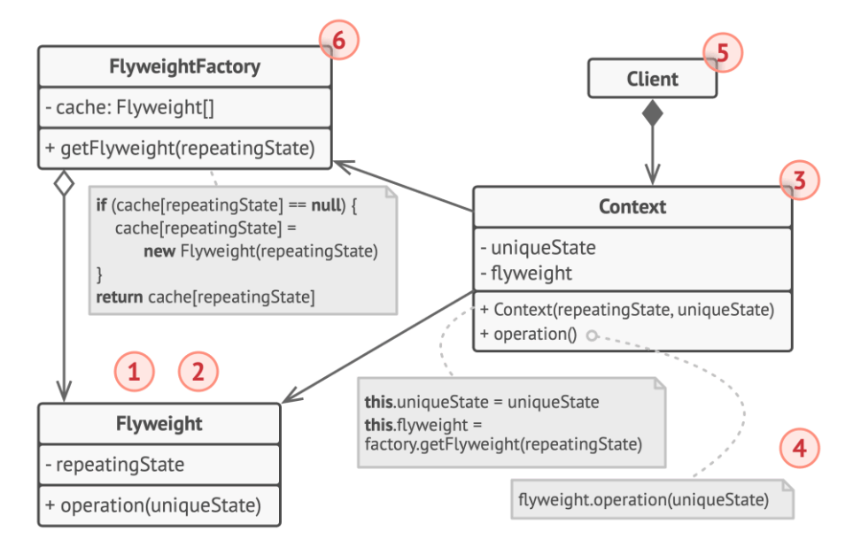
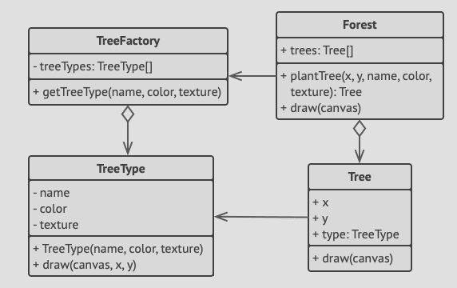

# Structure



1. The flyweight pattern is merely an optimization - before applying it, make sure the problem has the out-of-RAM issue it
   tries to solve.
2. The **Flyweight** class contains intrinsic state, that is shared across multiple objects.
3. The **Context** class contains extrinsic state, which is unique across all original object. When a context is paired with
   the flyweight, this becomes the full state of the object.
4. In most cases, the behaviour of the original object remains in the flyweight class, such that whoever calls a flyweight's
   object must also pass appropriate bits of the extrinsic state into the method's parameters.
   Inversely, the behaviour could be moved to the context class, which would use the linked flyweight merely as a data object.
5. The **Client** calculates or stores the extrinsic state of the flyweights, such that from the client's perspective, a
   flyweight is a template object which can be configured at runtime by passing some contextual data into parameters of its
   method.
6. The **Flyweight factory** manages a pool of existing flyweights. In this factory, clients pass bits of intrinsic state of
   a desired flyweight, and the factory looks for existing flyweights for a match and returns it, else simply creates a new
   one.

# Pseudocode
In our example, the flyweight pattern helps reduce memory usage when rendering millions of tree objects on a canvas.



- We extract the repeating intrinsic state from a main `Tree` class and moves it into the flyweight `TreeType` class.
- Now, instead of storing the same data in multiple objects, it's kept in just a few flyweight objects and linked to
  appropriate Tree objects which acts as contexts.
- The client code creates new tree objects using the flyweight factory, which encapsulates the complexity of searching for
  the right object and re-using it if needed.

```html
// The flyweight class contains a portion of the state of a
// tree. These fields store values that are unique for each
// particular tree. For instance, you won't find here the tree
// coordinates. But the texture and colors shared between many
// trees are here. Since this data is usually BIG, you'd waste a
// lot of memory by keeping it in each tree object. Instead, we
// can extract texture, color and other repeating data into a
// separate object which lots of individual tree objects can
// reference.
class TreeType is
    field name
    field color
    field texture
    constructor TreeType(name, color, texture) { ... }
    method draw(canvas, x, y) is
        // 1. Create a bitmap of a given type, color & texture.
        // 2. Draw the bitmap on the canvas at X and Y coords.
        
// Flyweight factory decides whether to re-use existing
// flyweight or to create a new object.
class TreeFactory is
    static field treeTypes: collection of tree types
    static method getTreeType(name, color, texture) is
        type = treeTypes.find(name, color, texture)
        if (type == null)
            type = new TreeType(name, color, texture)
            treeTypes.add(type)
        return type
        
// The contextual object contains the extrinsic part of the tree
// state. An application can create billions of these since they
// are pretty small: just two integer coordinates and one
// reference field.
class Tree is
    field x,y
    field type: TreeType
    constructor Tree(x, y, type) { ... }
    method draw(canvas) is
        type.draw(canvas, this.x, this.y)
        
// The Tree and the Forest classes are the flyweight's clients.
// You can merge them if you don't plan to develop the Tree
// class any further.
class Forest is
    field trees: collection of Trees

    method plantTree(x, y, name, color, texture) is
        type = TreeFactory.getTreeType(name, color, texture)
        tree = new Tree(x, y, type)
        trees.add(tree)

    method draw(canvas) is
        foreach (tree in trees) do
            tree.draw(canvas)
```
