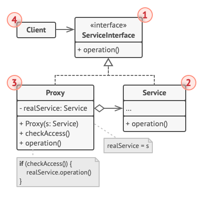
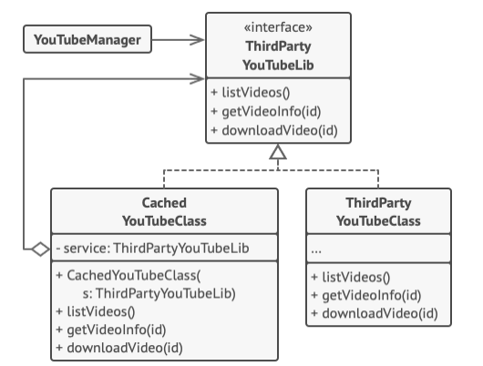

# Structure



1. The **Service Interface** declares the interface of the service. The proxy must follow this interface to be able to
   disguise itself as a service object.
2. The **Service** implements the **Service Interface** and is the actual object that does the business logic.
3. The **Proxy** class stores a reference field that points to a service object. It passes any requests to it to the service
   object. We can do extra work in the proxy e.g. access control, logging e.t.c, before or after calling the service object.
4. The **Client** should work with both services and proxies via the same interface, such that you can pass a proxy into any
   code that expects a service object.

# Pseudocode
Our example illustrates how the Proxy pattern can help to introduce lazy initialization and caching to a 3rd party YouTube
integration library.



The library provides us with a video downloading class, but it inneficient as calling it 6 times causes it to download the same
video six times, instead of caching and re-using the first video.
The proxy class implements the same interface as the original downloader and delegates all its work to it. However, it keeps
track of all downloaded videos and returns the cached result when the app requests the same video multiple times.

```h
// The interface of a remote service.
interface ThirdPartyYouTubeLib is
    method listVideos()
    method getVideoInfo(id)
    method downloadVideo(id)
    
// The concrete implementation of a service connector. Methods
// of this class can request information from YouTube. The speed
// of the request depends on a user's internet connection as
// well as YouTube's. The application will slow down if a lot of
// requests are fired at the same time, even if they all request
// the same information.
class ThirdPartyYouTubeClass implements ThirdPartyYouTubeLib is
    method listVideos() is
        // Send an API request to YouTube.

    method getVideoInfo(id) is
        // Get metadata about some video.

    method downloadVideo(id) is
        // Download a video file from YouTube.

// To save some bandwidth, we can cache request results and keep
// them for some time. But it may be impossible to put such code
// directly into the service class. For example, it could have
// been provided as part of a third party library and/or defined
// as `final`. That's why we put the caching code into a new
// proxy class which implements the same interface as the
// service class. It delegates to the service object only when
// the real requests have to be sent.
class CachedYouTubeClass implements ThirdPartyYouTubeLib is
    private field service: ThirdPartyYouTubeLib
    private field listCache, videoCache
    field needReset

    constructor CachedYouTubeClass(service: ThirdPartyYouTubeLib) is
        this.service = service

    method listVideos() is
        if (listCache == null || needReset)
            listCache = service.listVideos()
        return listCache

    method getVideoInfo(id) is
        if (videoCache == null || needReset)
            videoCache = service.getVideoInfo(id)
        return videoCache

    method downloadVideo(id) is
        if (!downloadExists(id) || needReset)
            service.downloadVideo(id)
            
// The GUI class, which used to work directly with a service
// object, stays unchanged as long as it works with the service
// object through an interface. We can safely pass a proxy
// object instead of a real service object since they both
// implement the same interface.
class YouTubeManager is
    protected field service: ThirdPartyYouTubeLib

    constructor YouTubeManager(service: ThirdPartyYouTubeLib) is
        this.service = service

    method renderVideoPage(id) is
        info = service.getVideoInfo(id)
        // Render the video page.

    method renderListPanel() is
        list = service.listVideos()
        // Render the list of video thumbnails.

    method reactOnUserInput() is
        renderVideoPage()
        renderListPanel()

// The application can configure proxies on the fly.
class Application is
    method init() is
        aYouTubeService = new ThirdPartyYouTubeClass()
        aYouTubeProxy = new CachedYouTubeClass(aYouTubeService)
        manager = new YouTubeManager(aYouTubeProxy)
        manager.reactOnUserInput()
```