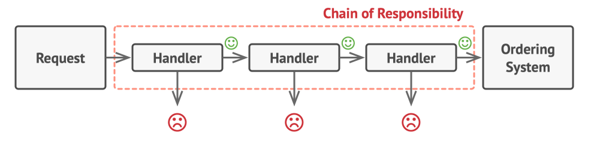

- Like many other behavioural design patterns, the Chain of Responsibility relies on transforming particular behaviours into
stand-alone objects called **handlers**.
- In our case, each check is extracted into it's own class with a single method that performs the check.
- The request, along with its data is passed to this method as an argument.
- The pattern suggests that you link these handlers into a chain. Each linked handler stores a reference to the next handler
  in the chain, and the request travels along the chain untill all handlers have had a chance to process it.
- A handler can decide to not pass the request further down the chain and effectively stop any further processing.

- This approach is very common when dealing with events in stacks of elements within a graphical user interface.
- For instance, when a user clicks a button, the event propagates through the chain of GUI elements that starts with the button,
  goes along its containers e.g forms or panels, and ends up in the main application window. The event is processed by the first
  element in the chain that is capable of handling it.
- The GUI idea does demonstrate that a chain can always be extracted from an object tree.
- It is crucial, however, that all handler classes implement the same interface. Each concrete hanlder should only care about
  the next one having the `execute()` method.
- This way, you can compose chains at runtime, using various handlers without coupling your code to their concrete classes.
