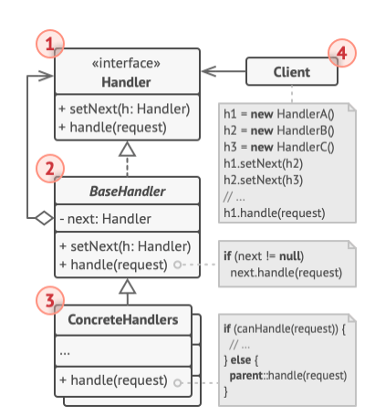
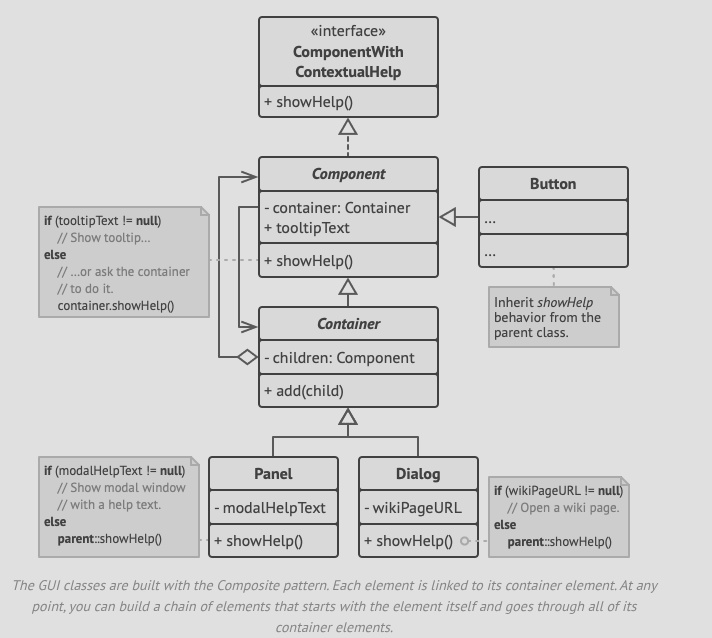
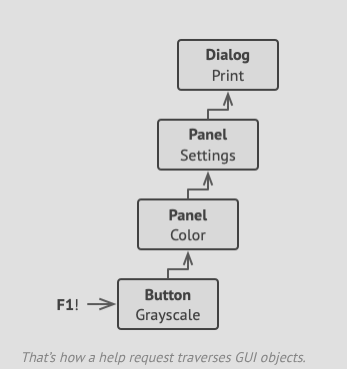

# Structure



1. The **Handler** declares the interface declares a common interface for all concrete handlers. Usually, it has a single
   method for handling the request, but may also have another method for setting the next handler on the chain.
2. The **Base Handler** is an optional class where you can put the boilerplate code thats common to all handler classes.
3. The **Concrete Handlers** contain the actual code for processing requests. Upon receiving a request, each handler must
   decide whether to process it and, additionally, whether to pass it along the chain.
4. The **Client** may compose the chains just once, or compose them dynamically depending on the application's logic.

# Pseudocode
- In our example here, the Chain of Responsibility pattern is responsible for displaying contextual help information
  for active GUI elements.



- The application's GUI is usually structured as a composite tree (we can use composite pattern for this)
- A simple component can show brief contextual tooltips, as long as the component has some help text assigned. 
- More complex components define their own way of showing contextual help, such as showing an excerpt from the manual or
  opening a page in a browser.
- When a user points the cursor at an element and presses the F1 key, the application detects the component under the pointer,
  and sends it  a help request. The request bubbles up through all the elements containers until it reaches the element that's
  capable of displaying the help information.



```h
// The handler interface declares a method for executing a request.
interface ComponentWithContextualHelp is
    method showHelp()

// The base class for simple components.
abstract class Component implements ComponentWithContextualHelp is
    field tooltipText: string

    // The component's container acts as the next link in the
    // chain of handlers.
    protected field container: Container

    // The component shows a tooltip if there's help text
    // assigned to it. Otherwise it forwards the call to the
    // container, if it exists.
    method showHelp() is
        if (tooltipText != null)
            // Show tooltip.
        else
            container.showHelp()
            
// Containers can contain both simple components and other
// containers as children. The chain relationships are
// established here. The class inherits showHelp behavior from
// its parent.
abstract class Container extends Component is
    protected field children: array of Component

    method add(child) is
        children.add(child)
        child.container = this


// Primitive components may be fine with default help
// implementation...
class Button extends Component is
// ...

// Primitive components may be fine with default help
// implementation...
class Button extends Component is
    // ...

// But complex components may override the default
// implementation. If the help text can't be provided in a new
// way, the component can always call the base implementation
// (see Component class).
class Panel extends Container is
    field modalHelpText: string

    method showHelp() is
        if (modalHelpText != null)
            // Show a modal window with the help text.
        else
            super.showHelp()

// ...same as above...
class Dialog extends Container is
    field wikiPageURL: string

    method showHelp() is
        if (wikiPageURL != null)
            // Open the wiki help page.
        else
            super.showHelp()
            
// Client code.
class Application is
    // Every application configures the chain differently.
    method createUI() is
        dialog = new Dialog("Budget Reports")
        dialog.wikiPageURL = "http://..."
        panel = new Panel(0, 0, 400, 800)
        panel.modalHelpText = "This panel does..."
        ok = new Button(250, 760, 50, 20, "OK")
        ok.tooltipText = "This is an OK button that..."
        cancel = new Button(320, 760, 50, 20, "Cancel")
        // ...
        panel.add(ok)
        panel.add(cancel)
        dialog.add(panel)

    // Imagine what happens here.
    method onF1KeyPress() is
        component = this.getComponentAtMouseCoords()
        component.showHelp()
```