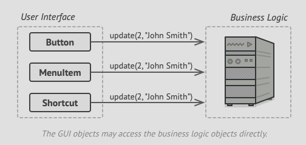
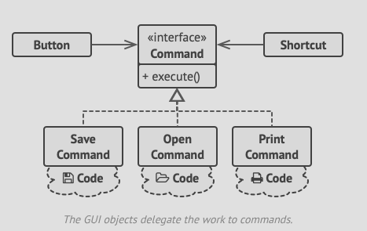

- A well-designed software enforces `separation of concerns`, usually involving breaking the app up into layers.
- In our case, we separate our app into a UI layer(what people see) and the business layer(what the app does).
- Ideally, when the GUI needs something from the business layer, the GUI object calls a object in the business layer, passing
  it some arguments, a process described as *an object sending another a request*

- The command pattern suggests that the GUI layer should not send these requests directly but instead wrap them in an object
  called a `Command` class that transports the arguments for it.
- The command class should have an `execute()` method that passes on the provided parameters to the business layer.
- Consequentially, the GUI doesn't have to know what part of the business layer needs to perform a provisioned task.
- Of major importance is to make sure your Commands implement the same interface, such that we can use various commands with
  the same requests sender, without coupling it with concretee classes of commands.
- As a bonus, we can swap commands at runtime, effectively changing what the same button does at will, at runtime.
- See the sample UML image below:

- You might have noticed that `execute()` method doesn't have any parameters, so how will it pass on the parameters received
  from the GUI layer to the business layer?
- Well ideally, the Command should either be pre-configured with this data, or capable of getting its own.
- As a result, the command becomes a convenient middle layer that reduces coupling between the GUI and business logic layer.