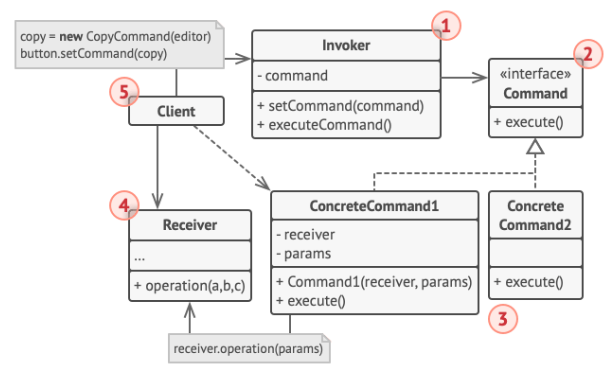
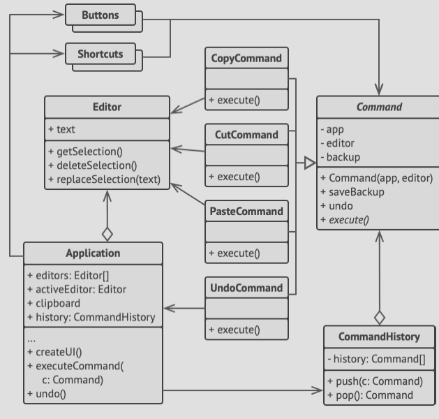

# Structure



1. The **Sender** class (also called the *Invoker* class) is responsible for initiating requests. This class must have a field
   for storing a reference to a command object.
   The sender triggers that command instead of sending the request directly to the receiver.
   The sender, however, isn't responsible for creating the command object, it ususally gets a pre-created command from the
   client via the constructor.
2. The **Command** interface usually just declares a single method for executing the command.
3. The **ConcreteCommands** implement various kinds of requests. A concrete command isn't supposed to perform the work on its
   own but rather passes the call to one of the business layer objects.
   Parameters required to execute a method on the business layer can be set as fields in the concrete command. To make the
   command objects immutable, we can only allow setting of these fields via the command object's constructor.
4. The **Receiver** class sits on the business logic side of things, and is reffered to as the *receiver*.
5. The **Client** creates and configures concrete command objects, passing it all the parameters, including the target
   receiver via the command's constructor.
   After that, the resulting command may be associated with one or more multiple senders.

# Pseudocode
In our example here, we demo how the **Command** pattern can help us track the history of executed operations, and make
it possible to revert an operation if needed.



- Commands that result in changing the state of the editor (e.g. cutting / pasting) make a backup copy of the editor's state
  before executing an operation associated with the command.
- After a command is executed, it is placed into the command history (a stack of command objects), along with the backup copy
  of the editor's state at that point.
- Later, if the user needs to revert an operation, the app can take the most recent command from the history, read the 
  associated backup of the editor's state and restore it.
- The client code (GUI elements, command history e.t.c) isn't coupled to concrete command classes because it works with
  commands via the command interface.
- This approach lets you introduce new commands into the app without breaking any existing code.

```h
// The base command class defines the common interface for all
// concrete commands.
abstract class Command is
    protected field app: Application
    protected field editor: Editor
    protected field backup: text

    constructor Command(app: Application, editor: Editor) is
        this.app = app
        this.editor = editor

    // Make a backup of the editor's state.
    method saveBackup() is
        backup = editor.text

    // Restore the editor's state.
    method undo() is
        editor.text = backup

    // The execution method is declared abstract to force all
    // concrete commands to provide their own implementations.
    // The method must return true or false depending on whether
    // the command changes the editor's state.
    abstract method execute()

// The concrete commands go here.
class CopyCommand extends Command is
    // The copy command isn't saved to the history since it
    // doesn't change the editor's state.
    method execute() is
        app.clipboard = editor.getSelection()
        return false

class CutCommand extends Command is
    // The cut command does change the editor's state, therefore
    // it must be saved to the history. And it'll be saved as
    // long as the method returns true.
    method execute() is
        saveBackup()
        app.clipboard = editor.getSelection()
        editor.deleteSelection()
        return true

class PasteCommand extends Command is
    method execute() is
        saveBackup()
        editor.replaceSelection(app.clipboard)
        return true

// The undo operation is also a command.
class UndoCommand extends Command is
    method execute() is
        app.undo()
        return false
        

// The global command history is just a stack.
class CommandHistory is
    private field history: array of Command

    // Last in...
    method push(c: Command) is
        // Push the command to the end of the history array.

    // ...first out
    method pop():Command is
        // Get the most recent command from the history.
        
// The editor class has actual text editing operations. It plays
// the role of a receiver: all commands end up delegating
// execution to the editor's methods.
class Editor is
    field text: string

    method getSelection() is
        // Return selected text.

    method deleteSelection() is
        // Delete selected text.

    method replaceSelection(text) is
        // Insert the clipboard's contents at the current
        // position.
        
// The editor class has actual text editing operations. It plays
// the role of a receiver: all commands end up delegating
// execution to the editor's methods.
class Editor is
    field text: string

    method getSelection() is
        // Return selected text.

    method deleteSelection() is
        // Delete selected text.

    method replaceSelection(text) is
        // Insert the clipboard's contents at the current
        // position.


// The application class sets up object relations. It acts as a
// sender: when something needs to be done, it creates a command
// object and executes it.
class Application is
    field clipboard: string
    field editors: array of Editors
    field activeEditor: Editor
    field history: CommandHistory

    // The code which assigns commands to UI objects may look
    // like this.
    method createUI() is
        // ...
        copy = function() { executeCommand(
            new CopyCommand(this, activeEditor)) }
        copyButton.setCommand(copy)
        shortcuts.onKeyPress("Ctrl+C", copy)

        cut = function() { executeCommand(
            new CutCommand(this, activeEditor)) }
        cutButton.setCommand(cut)
        shortcuts.onKeyPress("Ctrl+X", cut)

        paste = function() { executeCommand(
            new PasteCommand(this, activeEditor)) }
        pasteButton.setCommand(paste)
        shortcuts.onKeyPress("Ctrl+V", paste)

        undo = function() { executeCommand(
            new UndoCommand(this, activeEditor)) }
        undoButton.setCommand(undo)
        shortcuts.onKeyPress("Ctrl+Z", undo)

    // Execute a command and check whether it has to be added to
    // the history.
    method executeCommand(command) is
        if (command.execute())
            history.push(command)

    // Take the most recent command from the history and run its
    // undo method. Note that we don't know the class of that
    // command. But we don't have to, since the command knows
    // how to undo its own action.
    method undo() is
        command = history.pop()
        if (command != null)
            command.undo()
```
