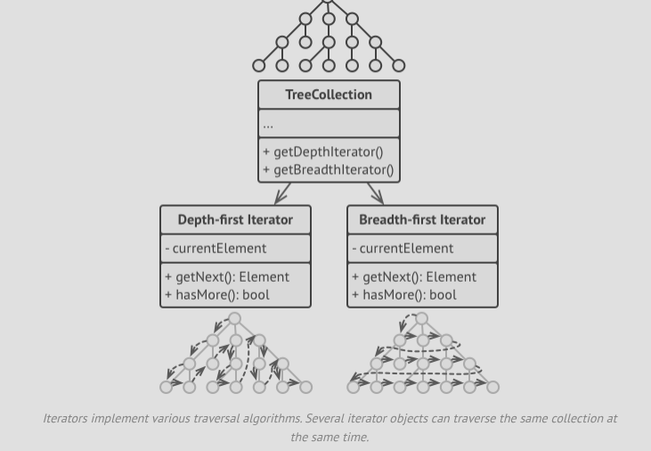

- The main idea of the iterator pattern is to extract the traversl behaviour of a collection into a separate object called
  an iterator.

- In addition to implementing the algorithm itself, an iterator object encapsulates all of the traversal details, such as the
  current position and how many elements are left till the end.
- Because of this, serveral iterators can go through the same collection at the same time independently of each other.
- Usually, iterators provide one primary method for fetching elements of a collection that the client can keep running until
  the method doesn't return anything, meaning the traversal has reached the end.
- All iterators must return the same interface, making the client code compatible with any collection type or traversal
  algorithm as long as there is a proper iterator.
- If you need a special way to traverse a collection, you just create a new iterator class, without having to change the
  collection or the client.
