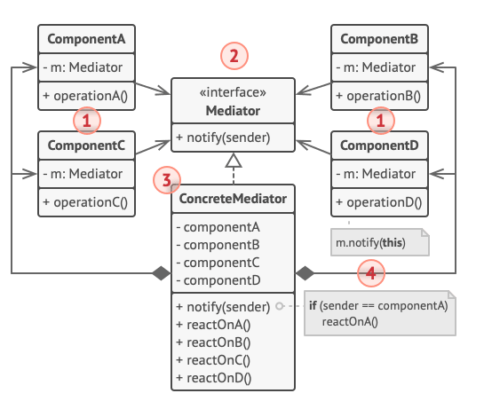
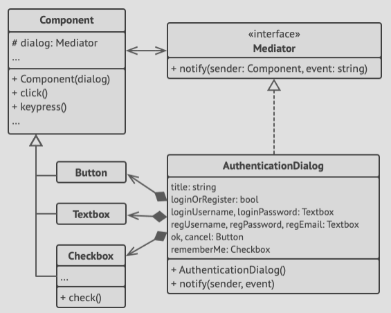

# Structure



1. **Components** are various classes that contain some business logic e.g. a button, checkbox, input field, e.t.c
   Each component has a reference to some mediator declared with the tupe of the mediator interface.
   The component isn't aware of the actual class of the mediator, so you can reuse the component in other programs by linking
   it to a different mediator.
2. The **Mediator** interface declares methods of communication with components, which usually include just a single
   notification method.
   Components may pass any context as arguments of this method, including their own objects, but only in such a way that no
   coupling occurs between a receiving component and the sender's class.
3. **Concrete Mediators** encapsulate relations between various components. Concrete mediators often keep references to all
   components they manage and sometimes even manage their lifecycle.
4. Components are not aware of other components. If something important happens within or to a component, it must only notify
   the mediator, which upon receiving the notification, will identify the sender, then decide what component to trigger in
   return.

# Pseudocode
In our example here, the mediator pattern helps you eliminate mutual dependencies between various UI classes: buttons,
checkboxes and text labels.



- An element triggered by a user doesn't communicate with other elements directly even if it looks like it's supposed to.
- Instead, the element only needs to let its mediator know about the event, passing any contextual information along with the
  notification.
- In our case, the whole authentication dialog acts as the mediator, knowing how concrete elements are sipposed to collaborate,
  facilitating their indirect communication.
- Upon receiving a notification about an event, the dialog decides when element should adress the event and directs the
  call accordingly.

```h
// The mediator interface declares a method used by components
// to notify the mediator about various events. The mediator may
// react to these events and pass the execution to other
// components.
interface Mediator is
    method notify(sender: Component, event: string)
    
// The concrete mediator class. The intertwined web of
// connections between individual components has been untangled
// and moved into the mediator.
class AuthenticationDialog implements Mediator is
    private field title: string
    private field loginOrRegisterChkBx: Checkbox
    private field loginUsername, loginPassword: Textbox
    private field registrationUsername, registrationPassword,
                  registrationEmail: Textbox
    private field okBtn, cancelBtn: Button

    constructor AuthenticationDialog() is
        // Create all component objects by passing the current
        // mediator into their constructors to establish links.

    // When something happens with a component, it notifies the
    // mediator. Upon receiving a notification, the mediator may
    // do something on its own or pass the request to another
    // component.
    method notify(sender, event) is
        if (sender == loginOrRegisterChkBx and event == "check")
            if (loginOrRegisterChkBx.checked)
                title = "Log in"
                // 1. Show login form components.
                // 2. Hide registration form components.
            else
                title = "Register"
                // 1. Show registration form components.
                // 2. Hide login form components

        if (sender == okBtn && event == "click")
            if (loginOrRegister.checked)
                // Try to find a user using login credentials.
                if (!found)
                    // Show an error message above the login
                    // field.
            else
                // 1. Create a user account using data from the
                // registration fields.
                // 2. Log that user in.
                // ...

// Components communicate with a mediator using the mediator
// interface. Thanks to that, you can use the same components in
// other contexts by linking them with different mediator
// objects.
class Component is
    field dialog: Mediator

    constructor Component(dialog) is
        this.dialog = dialog

    method click() is
        dialog.notify(this, "click")

    method keypress() is
        dialog.notify(this, "keypress")

// Concrete components don't talk to each other. They have only
// one communication channel, which is sending notifications to
// the mediator.
class Button extends Component is
    // ...

class Textbox extends Component is
    // ...

class Checkbox extends Component is
    method check() is
        dialog.notify(this, "check")
    // ...
```
