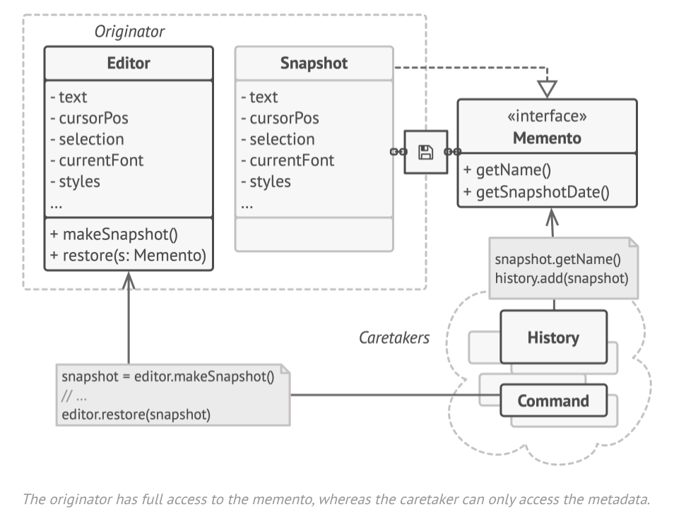

- The problems we are experiencing are due to encapsulation - some objects are trying to do more than they're supposed to.
- To collect daata required to perform some action, they invade the private space of other objects, instead of letting these
  objects do the actual action.
- The memento pattern delegates creating the state snapshots to the actual owner of the state - called the *originator* object.
- Hence, instead of other objects tryign to copy the editor's state from the 'outside', the editor itself can make the
  snapshot as it has full access to its own state.
- Memento suggestsstoring the copy of the object's state in a special object called *memento*.
- The contents of the memento aren't accessible by any other object except the one that produced it.
- Other objects must communicate with mementos using a limited interface which may allow fetching the snapshot's metadata - e.g
  creation time, name of the snapshoted operation e.t.c, but not the original state contained in the snapshot.

- Such a restrictive policy lets you store mementos inside other objects usually called *caretakers*
- Since a caretaker works with the memento only via the limited interface, it isn't able to tamper with the state stored inside
  the memento.
- At the same time, the originator has access to all fields inside the memenot, allowing it to restore it's previous state
  at will.
- For our text editor example, we can create a separate history class as a caretaker.
- A stack of mementos stored inside the caretaker will grow each time the editor is about to execute an operation.
- When the user triggers the undo, the history grabs the most recent memento from the stack and passes it back to the editor,
  requesting a rollback.
- Since the editor has full access to the memento, it changes its own state with values taken from the memento.