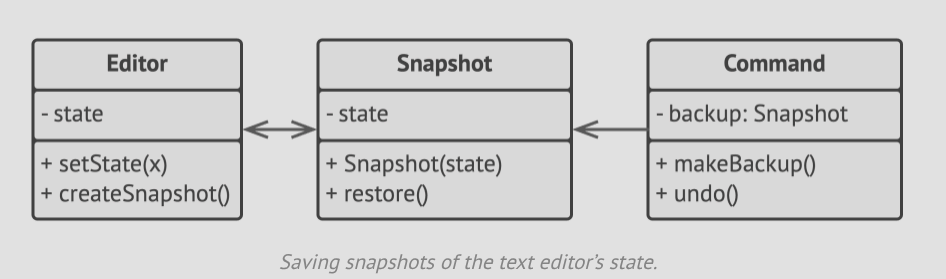

# Pseudocode

- Our example uses Memento pattern alongside Command pattern for storing snapshots of the complex text editor's state and
  restoring an earlier state from these snapshots when needed.



- The command objects act as cartakers. They fetch the memento before executing operations related to commands.
- When a user attempts to undo the most recent command, the editor can use the meemnto stored in that command to revert
  itself to a previous state.
- The memento class doesn't declare any public getters or setters, so no object can alter its state.
- A memento us linked to the editor object, allowing the memento to restore the linked editor's state by passing the data
  via setters on the editor object.
- Since mementos are linked to specific editor objects, you can make your app support several independent editor windows
  with a centralized undo stack.

```h
// The originator holds some important data that may change over
// time. It also defines a method for saving its state inside a
// memento and another method for restoring the state from it.
class Editor is
    private field text, curX, curY, selectionWidth

    method setText(text) is
        this.text = text

    method setCursor(x, y) is
        this.curX = x
        this.curY = y

    method setSelectionWidth(width) is
        this.selectionWidth = width

    // Saves the current state inside a memento.
    method createSnapshot():Snapshot is
        // Memento is an immutable object; that's why the
        // originator passes its state to the memento's
        // constructor parameters.
        return new Snapshot(this, text, curX, curY, selectionWidth)
        
// The memento class stores the past state of the editor.
class Snapshot is
    private field editor: Editor
    private field text, curX, curY, selectionWidth

    constructor Snapshot(editor, text, curX, curY, selectionWidth) is
        this.editor = editor
        this.text = text
        this.curX = x
        this.curY = y
        this.selectionWidth = selectionWidth

    // At some point, a previous state of the editor can be
    // restored using a memento object.
    method restore() is
        editor.setText(text)
        editor.setCursor(curX, curY)
        editor.setSelectionWidth(selectionWidth)
        
// A command object can act as a caretaker. In that case, the
// command gets a memento just before it changes the
// originator's state. When undo is requested, it restores the
// originator's state from a memento.
class Command is
    private field backup: Snapshot

    method makeBackup() is
        backup = editor.createSnapshot()

    method undo() is
        if (backup != null)
            backup.restore()
    // ...
```