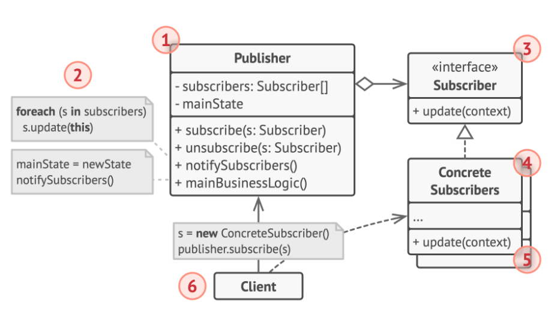
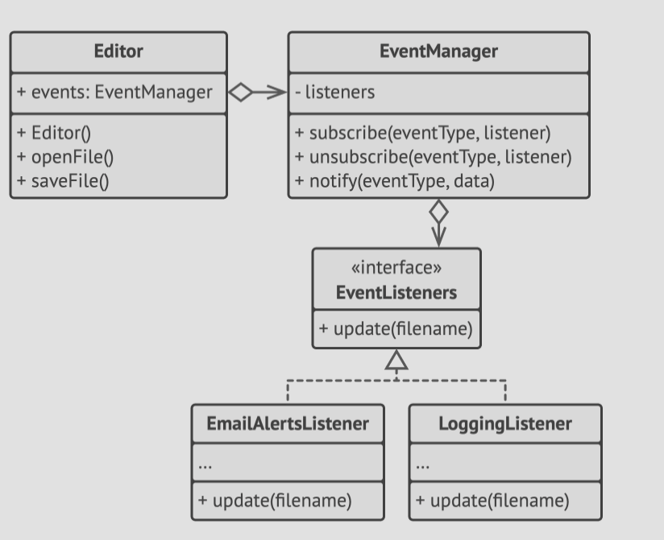

# Structure



1. The **Publisher** issues events of interest to other objects. The events occurs when the state of the publisher changes or
   the publisher executes some state.
  Publishers expose a subscription infrastructure that subscribers can join or leave at will.
2. When a new event happens, the publisher goes ober the subscription list and calls the notification method declared in the
   subscriber interface on each subscriber object.
3. The **Subscriber** interface declares the notification interface, in most cases consisting of a single `update` method.
   The method may have several parameters, allowing the publisher to pass some event details along with the update.
4. **Concrete Subscribers** perform some actions in response to notifications issued by the publisher. All these classes must
   implement the same interface, so the publisher isn't coupled to the concrete classes.
5. ...
6. The **Client** creates the publisher and subscriber objects separately and then registers subscribers for publisher updates.

# Pseudocode
- In this example, the Observer pattern lets the text editor object notify other service objects about changes in it's state.



- The list of subscribers is compled dynamically, allowing objects to start or stop listening to notifications at runtime,
  depending on the desired behaviour of your app.
- In this example, the editor class delegates the job of maintaining the subscription list to a special helper object.

```h
// The base publisher class includes subscription management
// code and notification methods.
class EventManager is
    private field listeners: hash map of event types and listeners

    method subscribe(eventType, listener) is
        listeners.add(eventType, listener)

    method unsubscribe(eventType, listener) is
        listeners.remove(eventType, listener)

    method notify(eventType, data) is
        foreach (listener in listeners.of(eventType)) do
            listener.update(data)

// The concrete publisher contains real business logic that's
// interesting for some subscribers. We could derive this class
// from the base publisher, but that isn't always possible in
// real life because the concrete publisher might already be a
// subclass. In this case, you can patch the subscription logic
// in with composition, as we did here.
class Editor is
    public field events: EventManager
    private field file: File

    constructor Editor() is
        events = new EventManager()

    // Methods of business logic can notify subscribers about
    // changes.
    method openFile(path) is
        this.file = new File(path)
        events.notify("open", file.name)

    method saveFile() is
        file.write()
        events.notify("save", file.name)

    // ...


// Here's the subscriber interface. If your programming language
// supports functional types, you can replace the whole
// subscriber hierarchy with a set of functions.
interface EventListener is
    method update(filename)

// Concrete subscribers react to updates issued by the publisher
// they are attached to.
class LoggingListener implements EventListener is
    private field log: File
    private field message: string

    constructor LoggingListener(log_filename, message) is
        this.log = new File(log_filename)
        this.message = message

    method update(filename) is
        log.write(replace('%s',filename,message))

class EmailAlertsListener implements EventListener is
    private field email: string
    private field message: string

    constructor EmailAlertsListener(email, message) is
        this.email = email
        this.message = message

    method update(filename) is
        system.email(email, replace('%s',filename,message))


// An application can configure publishers and subscribers at
// runtime.
class Application is
    method config() is
        editor = new Editor()

        logger = new LoggingListener(
            "/path/to/log.txt",
            "Someone has opened the file: %s")
        editor.events.subscribe("open", logger)

        emailAlerts = new EmailAlertsListener(
            "admin@example.com",
            "Someone has changed the file: %s")
        editor.events.subscribe("save", emailAlerts)
```