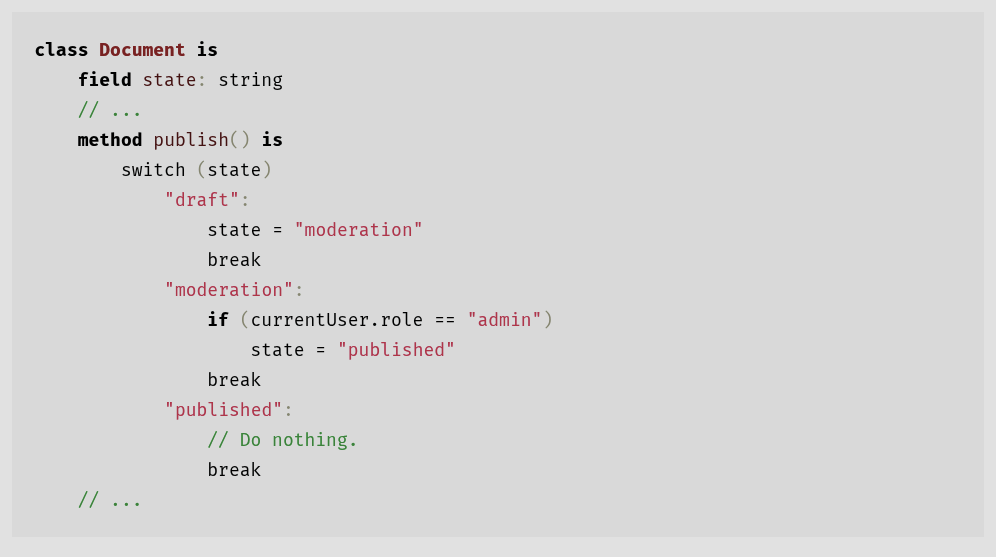

Is a behavioural design pattern that lets an object alter its behaviour when its internal state changes, making it appear
as if the object changed its class.

# Problem
- Imagine we have a `Document` class that can be in one of three states: `Draft`, `Moderation` and `Published`.
- Depending on the state, the `publish` method of the document will:
1. In `Draft`, move the document to moderation.
2. In `Moderation`, make the document public but only if the current user is an admin.
3. In `Published`, do nothing at all.

- You might end up with code that looks something like this:

- Code like this is very difficult to maintain because any change to the transition logic may require changing state
  conditionals in every method.
- Likewise, as the project evolves, it is quite difficult to predict all possible states and transitions at the design
  stage, hence a lean state machine built with a limited set of conditionals can grow into a bloated mess over time.
