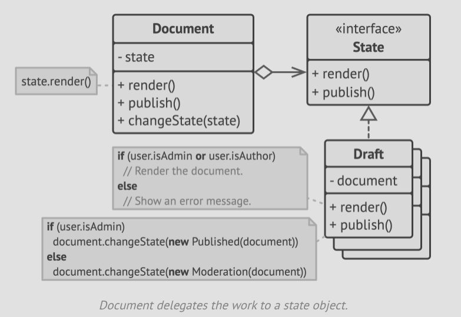

- The state pattern suggests that you create new classes for all possible states of an object and extract all state-specific
  behaviours into these classes.
- Instead of implementing all behaviours on its own, the original object, called a *context* stores a reference to one of
  the state objects that represents its current state, and delegates all the state-related work to that object.

- To transition the context to another state, we replace the active state object with another object that represents the
  new state.
- This is enabled by ensuring that all states objects follow the same interface, and the context itself refers to these
  state using the interface only.
- Sometimes, unlike **Strategy** pattern, the states in **State** pattern my be aware of each other.