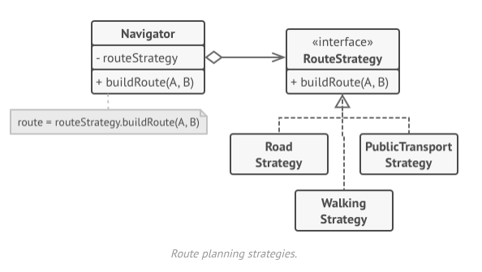

- The strategy pattern suggests that you take a class that does something specific in a lot of different ways and extract all
  these algorithms into separate classes called *strategies*.
- The original class called *context* must have a field for storing the reference to one of these strategies.
- The context delegates the work to a linked strategy instead of executing it on its own.
- The client passes the desired strategy to the context instead of the context having to select one for itself.
- In fact, the context doesn't know much about the strategies, it just works with them through a generic interface, which
  exposes a single method for triggering the algorithm encapsulated within the selected strategy.
- This way, you can easily add new algorithms or modify existing ones without changing the code of the context or other
  strategies.

- Back to our navigation app, each routing algorithm can be extracted to its own class with a single `buildRoute()` method.
- The route accepts an origin and a destination and returns a collection of the route's checkpoints.