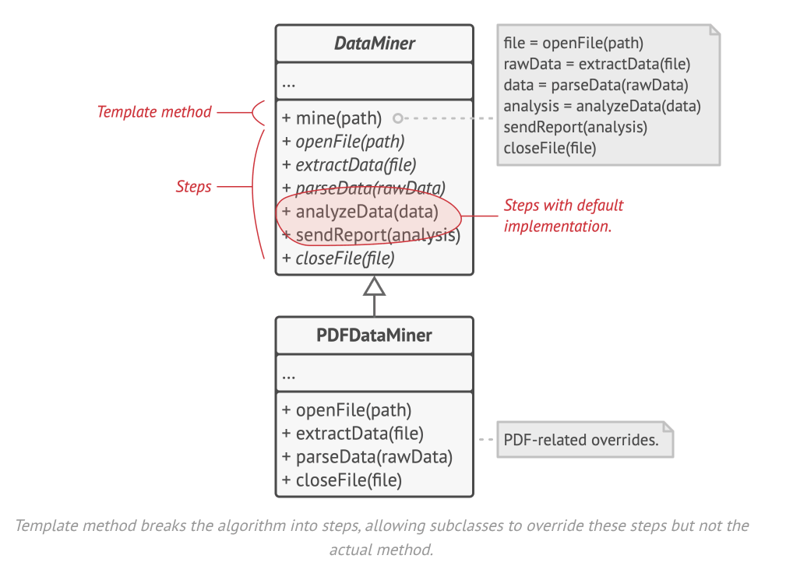

- The template method suggests that you break down an algorithm into a series of steps, turn these steps into methods
  and put a series of calls to thes emethods inside a single template method.
- The steps may either be `abstract` or have some default implementation.
- To use the algorithm, the client is supposed to provide its own subclass, implement all abstract steps and override
  some of the optional ones if needed, but not the template method itself.
- In our data miner app, we create a base class for all three parsing algorithms, which defines a series of calls to
  various document-processing steps.

- At first we can declare all steps as abstract, forcing all subclasses to provide their own implementations of these
  methods.
- But its looks like the code for opening/closing files and extracting/parsing data is different for various data
  formats, so we allow the child classes to have their own ways of doing these.
- But, implementation of other steps like analyzing the raw data and composing reports is very similar, so it can
  be pulled up into the base class, where subclasses cans hare that code.
- We can also create *hooks* which are optional steps with an empty body - These are placed before and after crucial
  steps of an algorithm, providing subclasses with additional extension points for an algorithm.