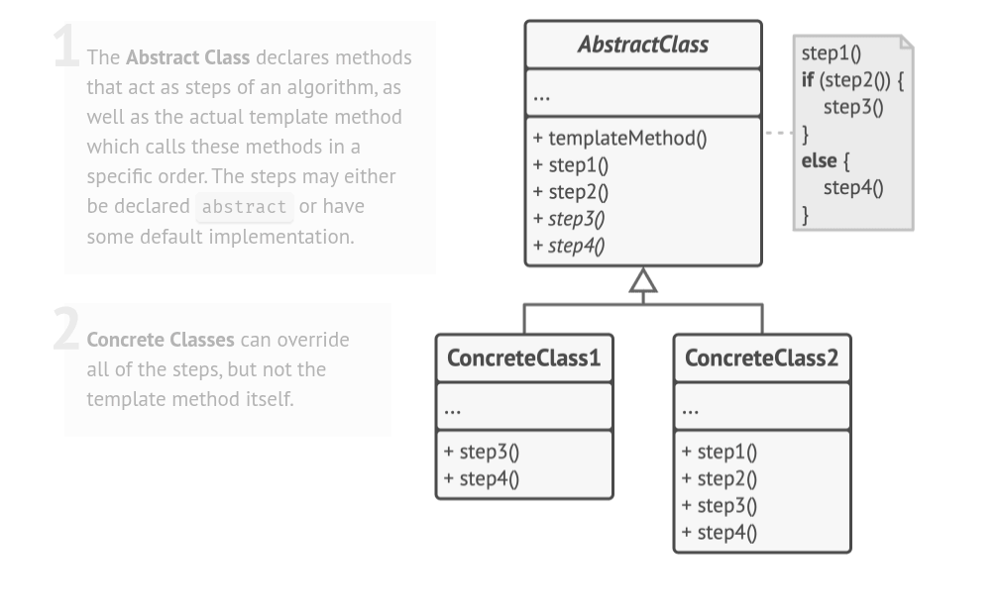

# Structure



1. The **Abstract** class declares methods that act as steps of an algorithm, as well as the actual template method
   that calls these methods in a specific order.
   The steps may either be declared `abstract` or have some default implementation.
2. **Concrete Classes** can override all of the steps, but not the templte method itself.

# Pseudocode
In this example, the template method provides a 'skeleton' for various branches of AI in a simple strategy video game.

```h
// The abstract class defines a template method that contains a
// skeleton of some algorithm composed of calls, usually to
// abstract primitive operations. Concrete subclasses implement
// these operations, but leave the template method itself
// intact.
class GameAI is
    // The template method defines the skeleton of an algorithm.
    method turn() is
        collectResources()
        buildStructures()
        buildUnits()
        attack()

    // Some of the steps may be implemented right in a base
    // class.
    method collectResources() is
        foreach (s in this.builtStructures) do
            s.collect()

    // And some of them may be defined as abstract.
    abstract method buildStructures()
    abstract method buildUnits()

    // A class can have several template methods.
    method attack() is
        enemy = closestEnemy()
        if (enemy == null)
            sendScouts(map.center)
        else
            sendWarriors(enemy.position)

    abstract method sendScouts(position)
    abstract method sendWarriors(position)

// Concrete classes have to implement all abstract operations of
// the base class but they must not override the template method
// itself.

// Concrete classes have to implement all abstract operations of
// the base class but they must not override the template method
// itself.
class OrcsAI extends GameAI is
    method buildStructures() is
        if (there are some resources) then
            // Build farms, then barracks, then stronghold.

    method buildUnits() is
        if (there are plenty of resources) then
            if (there are no scouts)
                // Build peon, add it to scouts group.
            else
                // Build grunt, add it to warriors group.

    // ...

    method sendScouts(position) is
        if (scouts.length > 0) then
            // Send scouts to position.

    method sendWarriors(position) is
        if (warriors.length > 5) then
            // Send warriors to position.

// Subclasses can also override some operations with a default
// implementation.
class MonstersAI extends GameAI is
    method collectResources() is
        // Monsters don't collect resources.

    method buildStructures() is
        // Monsters don't build structures.

    method buildUnits() is
        // Monsters don't build units.
```