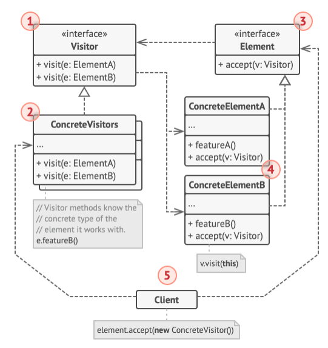
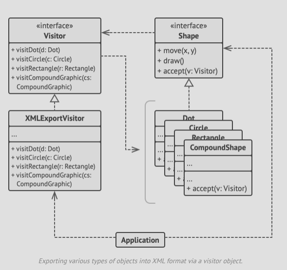

# Structure



1. The **Visitor** interface declares a set of visiting methods that take concrete elements of an object structure as arguments
   The methods may have the same name for a language that supports overloading but the parameter types must be different.
2. Each **Concrete Visitor** implements several versions of the same behaviour tailored for different concrete element
   classes.
3. The **Element** interface declares a method for 'accepting; visitors. This method should have one parameter declared with
   the type of the visitor interface.
4. Each **ConcreteElement** must implement the acceptance method. The method should redirect the call to the proper visitor's
   method corresponding to the current element class.
5. The **Client** usually represents a collection or some other complex object (e.g. a Composite tree).
   Clients usually aren't aware of all the concrete classes because they work with objects from that collection via some
   abstract interface.

# Pseudocode
- In this example, visitor pattern adds XML support to the class hierarchy of geometric shapes.



```h
// The element interface declares an `accept` method that takes
// the base visitor interface as an argument.
interface Shape is
    method move(x, y)
    method draw()
    method accept(v: Visitor)
    
// Each concrete element class must implement the `accept`
// method in such a way that it calls the visitor's method that
// corresponds to the element's class.
class Dot implements Shape is
    // ...

    // Note that we're calling `visitDot`, which matches the
    // current class name. This way we let the visitor know the
    // class of the element it works with.
    method accept(v: Visitor) is
        v.visitDot(this)

class Circle implements Shape is
    // ...
    method accept(v: Visitor) is
        v.visitCircle(this)

class Rectangle implements Shape is
    // ...
    method accept(v: Visitor) is
        v.visitRectangle(this)

class CompoundShape implements Shape is
    // ...
    method accept(v: Visitor) is
        v.visitCompoundShape(this)
        
// The Visitor interface declares a set of visiting methods that
// correspond to element classes. The signature of a visiting
// method lets the visitor identify the exact class of the
// element that it's dealing with.
interface Visitor is
    method visitDot(d: Dot)
    method visitCircle(c: Circle)
    method visitRectangle(r: Rectangle)
    method visitCompoundShape(cs: CompoundShape)

// Concrete visitors implement several versions of the same
// algorithm, which can work with all concrete element classes.
//
// You can experience the biggest benefit of the Visitor pattern
// when using it with a complex object structure such as a
// Composite tree. In this case, it might be helpful to store
// some intermediate state of the algorithm while executing the
// visitor's methods over various objects of the structure.
class XMLExportVisitor implements Visitor is
    method visitDot(d: Dot) is
        // Export the dot's ID and center coordinates.

    method visitCircle(c: Circle) is
        // Export the circle's ID, center coordinates and
        // radius.

    method visitRectangle(r: Rectangle) is
        // Export the rectangle's ID, left-top coordinates,
        // width and height.

    method visitCompoundShape(cs: CompoundShape) is
        // Export the shape's ID as well as the list of its
        // children's IDs.
        // The client code can run visitor operations over any set of
        // elements without figuring out their concrete classes. The
        // accept operation directs a call to the appropriate operation
        // in the visitor object.
        class Application is
            field allShapes: array of Shapes
        
            method export() is
                exportVisitor = new XMLExportVisitor()
        
                foreach (shape in allShapes) do
                    shape.accept(exportVisitor)
```